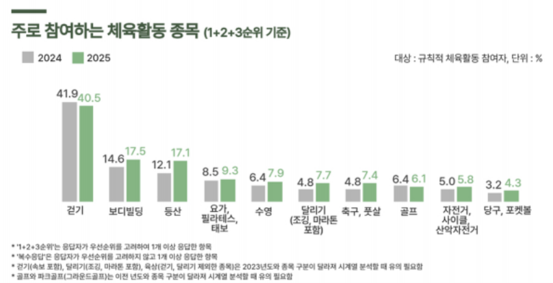
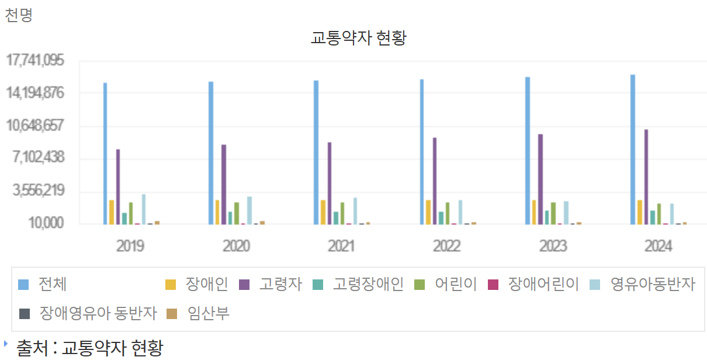
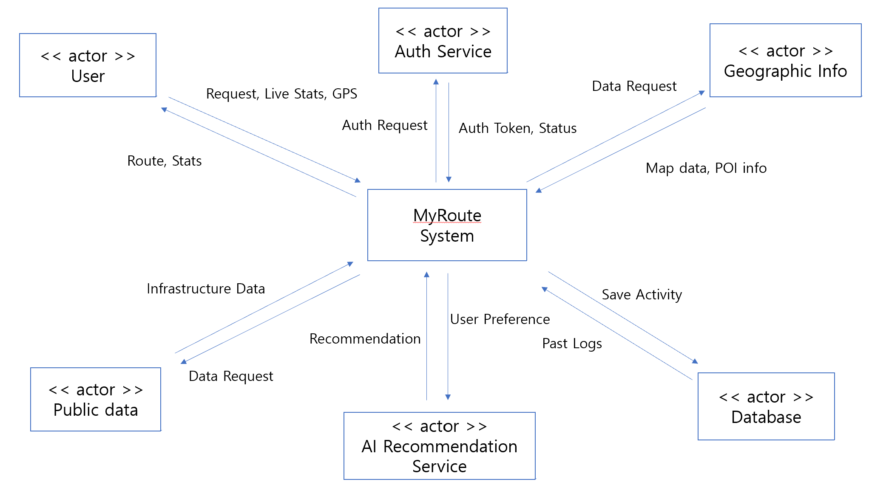

# **MyRoute** 
Conceptualization
 
 

 
 

**Student No: 22411863**

**Name: 진다혜**

**E-mail: jindahye0315_@naver.com**

 

## [ Revision history ]

Revision date|Version #|Description|Author
---|---|---|---
2025/03/21 | 0.1 | 초안 작성 완료 | 진다혜
2025/03/23 | 0.2 | use case 수정 | 진다혜
2025/03/25 | 1.0| 오타 수정 및 최종 검토 | 진다혜

 
 

## = Contents =
1. Business purpose .................................................................................. 

2. System context diagram ..................................................................... 

3. Use case list .............................................................................................

4. Concept of operation .......................................................................... 

5. Problem statement ............................................................................... 

6. Glossary ..................................................................................................... 

7. References ................................................................................................. 

 
 

## 1. Business Purpose
### 1.1 Project Background & Motivation
현대 사회에서 산책은 건강 관리와 스트레스 해소를 위한 필수 활동이다. 문화체육관광부의 2025 국민생활체육조사에 따르면 주로 참여하는 체육활동 종목의 40.5%가 걷기, 17.1%가 등산, 7.7%가 달리기(조깅, 마라톤 포함), 5.8%가 자전거, 사이클, 산악자전거로 약 70% 이상이 야외 활동 중심의 운동이다(아래 [그림 1-1] 참조). 하지만 기존의 지도 서비스는 모든 사용자에게 최단 거리 위주의 경로만을 제공한다.   
또한 국토교통부의 교통약자 현황에 따르면 교통약자 인구는 매년 증가하고 있다. 2024년 기준 교통약자 인구는 약 1,612만 명으로 전체 인구의 31.5%를 차지하며, 국민 3명 중 1명이 이동에 제약을 느끼고 있는 상황이다(아래 [그림 1-2] 참조). 그러나 이들이 필요로 하는 경사로 유무, 계단 없는 길 등의 정밀한 정보는 파편화되어 있어 접근이 어렵다. 이에 각자의 요구사항에 맞는 경로를 추천하고 기록하여 관리할 수 있는 서비스를 구상했다. 이 서비스를 통해 휠체어, 유아차, 노인 등 교통약자를 위한 경로뿐만 아니라 도심, 공원, 강변 등 각자의 취향에 맞는 경로를 추천해주어 맞춤형 경로를 추천할 수 있도록 한다. 

*[그림 1-1] 2025 국민생활체육조사 참여 종목 현황*

*[그림 1-2] 연도별 총인구 대비 교통약자 현황 (2019-2024)*

### 1.2 Goal
- 맞춤형 경로 추천: 사용자의 상황(유모차/휠체어, 반려동물 동반 등)에 최적화된 경로를 추천한다.

- 활동 로그 관리: 추천된 경로를 따라 이동한 실제 데이터를 기록하여 개인화된 운동 통계를 제공한다.

### 1.3 Target Market

- 자신의 활동(러닝, 산책, 등산 등)을 데이터로 기록 및 관리하며, 지형(평지, 강변, 산 등)이나 주변 환경에 대한 고유한 취향을 바탕으로 맞춤형 경로 추천을 원하는 사용자.

- 교통약자: 무장애 경로 정보가 필수적인 유모차 및 휠체어 이용자.

- 반려동물 보호자: 안전하고 반려동물 출입이 자유로운 산책로를 찾는 사용자.

- 자녀 동반 보호자: 아이들과 함께 활동할 수 있는 경로를 찾는 보호자.

 
 

## 2. System Context Diagram

### 2.1 Diagram

*[그림 2-1] System Context Diagram*

### 2.2 Description of Terms in Diagram
- MyRoute System: 경로 연산 및 데이터 통합.

- User: 경로를 요청(Request)하고 실시간 위치(GPS)를 전송하며 가이드를 받는 주체.

- Auth Service: 로그인 인증 요청을 처리하고 보안 토큰을 발급하는 서비스.

- Geographic Info: 지도 이미지와 장소(POI) 좌표 데이터를 제공하는 외부 API.

- Database: 활동 기록을 저장(Save Activity)하고 과거 이력(Past Logs)을 불러오는 저장소입니다.

- AI Recommendation Service: 사용자 취향을 분석해 맞춤형 경로를 추천하는 AI .

- Public Data: 경사로, 공원 등 공공 인프라 정보를 제공하는 데이터 소스.

 
 

## 3. Use case list
### 1) 로그인 (Login)
| Actor | User, Auth Service, Database |
|---|---|
| Description | 사용자가 자신의 아이디로 로그인한다. |

### 2) 계정 관리 (Account Management)
| Actor | User, Auth Service, Database |
|---|---|
| Description | 서비스 이용을 위한 회원가입, 정보 수정 및 회원 탈퇴를 수행한다. 사용자의 가입 정보를 Database에 신규 등록하거나 기존 데이터를 수정 및 삭제하여 개인정보를 관리한다. |

### 3) 맞춤 프로필 설정 (Custom Profile Setting)
| Actor | User, Database |
|---|---|
| Description | 사용자의 이동 제약 사항이나 보행 선호도 등을 설정한다. 입력된 프로필 데이터는 Database에 기록하여 추천에 활용한다. |

### 4) 시설 탐색 (Facility Search)
| Actor | User, Public Data, Geographic Info |
|---|---|
| Description | 현재 위치 또는 목적지 주변의 편의 시설을 탐색한다. Geographic Info 상에 Public Data로부터 수집된 시설 위치 정보를 아이콘으로 띄워서 사용자에게 제공한다. |

### 5) 최적 경로 추천 (Optimal Route Recommendation)
| Actor | User, AI Recommendation Service, Geographic Info, Public Data |
|---|---|
| Description | 목적지까지의 최적 경로를 산출해서 추천한다. AI Recommendation Service가 사용자 프로필과 Public Data의 도로 정보(경사도, 노면 상태), Geographic Info의 지형 데이터를 종합 분석하여 가장 사용자에게 맞는 경로를 제안한다.|

### 6) 실시간 경로 안내 및 주행 기록 (Navigation & Logging)
| Actor | User, Geographic Info, Database |
|---|---|
| Description | 목적지까지의 실시간으로 길을 안내한다. Geographic Info를 통해 사용자의 GPS 위치를 실시간 추적하여 안내하며, 이동 경로 및 주행 로그 데이터를 Database에 지속적으로 기록한다. |

### 7) 이동 통계 및 리포트 확인 (Statistics & Report)
| Actor | User, Database |
|---|---|
| Description | 사용자의 과거 활동 내역을 분석하여 제공한다. Database에 저장된 주행 로그를 바탕으로 이동 거리, 시간, 건강 통계 리포트를 생성하여 사용자에게 보여준다. |

### 8) 변경사항 제보 (Change Reporting)
| Actor | User, Database, Public Data |
|---|---|
| Description | 지도에 반영되지 않은 도로 위 장애물 정보나 서비스의 설명과 다른 사항들을 제보한다. 사용자가 입력한 제보 내용은 Database에 저장되며, 향후 Public Data의 한계를 보완하기 위해 활용될 수 있다.|

### 9) 활동 성과 및 배지 관리 (Achievement & Reward Management)
| Actor | User, Database |
|---|---|
| Description | 사용자의 활동량에 따른 보상을 관리한다. Database에 기록된 이동 거리나 제보 횟수가 특정 목표에 도달하면 디지털 배지를 부여하고 성과 지표를 갱신하여 사용자의 참여를 독려한다. |

### 10) 경로 공유 (Favorites & Sharing)
| | |
|---|---|
| Actor | User, Database |
| Description | 선호하는 경로를 저장해서 바로 사용할 수 있도록하고 자신의 경로를 다른 사용자와 공유한다. 자주 가는 장소 및 경로 데이터를 Database에 저장하여 관리하며, 저장된 데이터를 기반으로 커뮤니티 내 공유 기능을 수행한다.

 
 

## 4. Concept of operation
### 1) 로그인 (Login)
| | |
|---|---|
| Purpose | 앱을 사용하기 위해 등록된 사용자인지 확인한다.|
|Approach|사용자가 앱을 실행 후 로그인 시, ID, PW를 입력 후 로그인을 요청하면 서버에서 회원 정보를 조회 후 로그인 성공/실패 여부를 확인한다.|
|Dynamics|앱 실행 시 로그인할 경우|
|Goals|안전한 사용자 인증 및 개인 데이터 보안을 유지한다.|

### 2) 계정 관리 (Account Management)
| | |
|---|---|
| Purpose | 사용자의 개인정보를 시스템에 등록하고 관리한다. |
|Approach| 회원가입 시 사용자 데이터를 Database에 신규 저장하며, 정보 수정이나 탈퇴 요청 시 해당 데이터를 업데이트하거나 삭제 처리한다. |
|Dynamics|최초 서비스 가입 시 또는 마이페이지에서 정보를 수정하거나 서비스 탈퇴를 원하는 경우 |
|Goals| 효율적인 사용자 계정 관리 시스템을 구현한다.|

### 3) 맞춤 프로필 설정 (Custom Profile Setting)
| | |
|---|---|
| Purpose | 사용자의 특성에 최적화된 경로 탐색 기준을 수립한다.
|Approach| 사용자가 선택한 선호도를 Database에 저장하고, 경로 탐색 시 활용하기 위해 전달한다. |
|Dynamics| 계정 생성 직후 및 경로를 추천할 경우|
|Goals| 개인별 맞춤형 이동 환경 데이터를 조성한다. |

### 4) 시설 탐색 (Facility Search)
| | |
|---|---|
| Purpose | 이동 중 필요한 시설의 위치를 안내한다. 
|Approach|Geographic Info API와 Public Data를 결합하여 현재 위치 기반의 편의시설 정보를 지도상에 보여준다.|
|Dynamics|사용자가 주변 시설 정보를 조회하거나 특정 시설을 검색할 경우|
|Goals|교통약자의 정보 접근성 및 이동 편의성을 높인다.|

### 5) 최적 경로 추천 (Optimal Route Recommendation)
| | |
|---|---|
| Purpose | 사용자의 특성과 실시간 도로 환경을 고려한 맞춤형 이동 동선을 제안한다.
|Approach|AI Recommendation Service가 Database의 사용자 프로필, Public Data의 도로 상태, Geographic Info의 지형 정보를 종합 분석하여 최적의 경로를 도출한다.|
|Dynamics|목적지를 검색하고 자신에게 가장 적합한 보행 경로를 탐색할 경우|
|Goals|물리적 제약 요소를 최소화한 사용자 맞춤형 이동 경로를 제공한다.|

### 6) 실시간 경로 안내 및 주행 기록 (Navigation & Logging)
| | |
|---|---|
| Purpose | 실제 이동 과정에서 정확한 길 안내를 제공하고 활동 데이터를 수집한다.
|Approach|Geographic Info를 기반으로 사용자의 위치를 실시간 추적하여 안내를 수행해서 지도에 보여주며, 동시에 실제 이동 경로와 주행 로그를 Database에 지속적으로 저장한다.|
|Dynamics|사용자가 실제 보행 및 이동을 시작하는 경우|
|Goals|실시간 내비게이션 기능을 구현하고 분석용 주행 데이터를 확보한다.|

### 7) 이동 통계 및 리포트 확인 (Statistics & Report)
| | |
|---|---|
| Purpose | 사용자의 과거 활동 데이터를 분석하여 이동 지표를 제공한다.
|Approach|Database에 저장된 주행 로그를 호출하여 이동 거리, 소요 시간 등을 계산하고 시각화된 리포트 형태로 생성하여 사용자에게 제시한다.|
|Dynamics|보행 종료 후 활동 결과를 확인하거나 과거 이동 이력을 분석하고자 할 경우|
|Goals|데이터 기반의 체계적인 활동 관리 및 성취감을 제공한다.|

### 8) 변경사항 제보 (Change Reporting)
| | |
|---|---|
| Purpose | 실제 환경과 다르거나 새로 발생한 도로 정보를 제보한다.
|Approach|사용자가 입력한 제보 내용을 Database에 저장하며, 이를 통해 기존 Public Data의 정보 공백을 보완한다.|
|Dynamics|지도 정보와 실제 상황이 다를 경우|
|Goals|사용자 참여를 통해 데이터의 정확성과 최신성을 유지한다.|

### 9) 활동 성과 및 배지 관리 (Achievement & Reward Management)
| | |
|---|---|
| Purpose | 사용자의 지속적인 서비스 이용을 독려한다.
|Approach|Database에 누적된 활동량을 체크하여 특정 목표 달성 시 디지털 배지를 부여하고, 성과 지표를 갱신하여 사용자 프로필에 반영한다.|
|Dynamics|설정된 이동 목표를 달성하였을 경우|
|Goals|서비스 사용의 재미를 증대시키고 사용자의 지속적인 사용을 유도한다.|

### 10) 경로 공유 (Favorites & Sharing)
| | |
|---|---|
| Purpose | 유용한 경로 정보의 재사용성을 높이고 사용자 간 정보 교류를 활성화한다. 
|Approach|특정 장소나 경로를 Database에 북마크로 저장하여 관리하며, 커뮤니티 기능을 통해 저장된 경로 데이터를 타 사용자에게 전송하거나 공유한다.|
|Dynamics|자주 가는 경로를 저장하고 싶거나 자신이 발견한 좋은 경로를 타인에게 추천하고 싶은 경우|
|Goals|경로 리스트 관리 및 커뮤니티 중심의 정보 공유 체계를 만든다.|

 
 

## 5. Problem statement
### Overview
본 서비스는 사용자의 고유한 취향과 보행 환경을 반영하여 최적의 경로를 추천하고, 이동 데이터를 체계적으로 관리하는 서비스이다. 단순한 최단 거리 안내를 넘어 도로 환경을 반영하고 개인의 상황과 선호에 맞춘 경험을 제공하기 위해 시스템 구축 과정에서 반드시 고려해야 할 기술적 난제와 품질 기준이 존재한다. 아래에서는 시스템이 해결해야 할 주요 문제점과 비기능적 요구사항들이다.

### 5.1 Technical Problems
- **Problem #1: 다양한 요소를 이용한 경로 탐색 최적화**
이 시스템은 기존의 다양한 지도 서비스와는 다르게 경사도, 계단이나 엘리베이터 등의 노면 상태, 편의시설 인접성, 그리고 혼잡도 등 다양한 변수를 복합적으로 계산해야 한다. 이 과정에서 각 요소에 부여되는 가중치에 따라 경로의 품질이 크게 달라질 수 있다. 그러므로 AI Recommendation Service의 효율성과 응답 속도에 대한 고려가 필요할 것이다.

- **Problem #2: 데이터 통합 및 신뢰성 확보**
공공 데이터는 정기적으로 갱신되지만 실제 도로의 갑작스러운 공사나 파손 정보, 신규 설치된 시설 등을 빠르게 반영하기는 어렵다. 이를 보완하기 위해 변경 사항 제보 기능으로 데이터를 추가하기로 했다. 이때 공공 데이터와 사용자 제보 데이터 간의 정보 불일치가 발생하는데 어떤 데이터를 우선할 것인지에 대한 기준과 허위 제보를 필터링할 수 있는 검증 시스템이 필요할 것이다.

- **Problem #3: 정밀 보행 위치 인식**
보행자 내비게이션은 차량용에 비해 이동 속도가 느리고 미세한 경로 변화를 정확히 인식해야 한다. 그러나 보행자의 경우 이동 속도도 느리고, 주변의 고층 건물이 많으면 GPS 오류가 발생하기 쉽기 때문에 위치 오차를 보정하거나 오류에 대응할 수 있는 방안이 필요할 것이다. 

- **Problem #4: 정보 보안 및 프라이버시**
이 서비스는 사용자의 실시간 위치 정보와 과거 주행 로그를 저장한다. 이동 경로는 개인의 생활 패턴이 드러나는 민감한 정보이며 실시간 정보까지 수집하기 때문에 보안이 철저해야 할 것이다. 또한 경로 공유 기능 등 커뮤니티 기능에서 개인을 식별할 수 있는 정보가 노출되지 않도록 철저하게 보안 관리가 필요할 것이다.

### 5.2 Non-Functional Requirements (NFRs)
- 경로 탐색 요청 시 결과 출력까지의 응답 시간은 최대 3초로 한다.
- 핵심 기능들은 메인 화면에서 3회 이내의 터치로 접근할 수 있도록 한다.
- 사용자의 위치 및 주행 로그 등 모든 개인 정보의 보안을 철저하게 유지한다.
- 많은 사용자가 사용하더라도 시스템이 안정적으로 기능하도록 한다.

 
 

## 6. Glossary
| 용어 | 설명 |
|--|--|
| 주행 로그 | 사용자가 실제로 이동한 GPS 경로와 시간, 거리 등의 활동 데이터를 기록한 결과물 |
| 변경사항 제보 | 사용자가 실제 도로 상황과 지도 정보의 불일치를 발견했을 때 시스템에 보고하여 데이터를 최신화할 수 있도록 하는 기능|
| POI | 지도상에 표시되는 특정 시설물이나 장소를 의미하며 본 서비스에서는 주로 보행 편의 시설(엘리베이터, 장애인 화장실 등)이나 화장실, 편의점 등을 지칭함 |
| Public Data(공공데이터) | 정부나 공공기관에서 제공하는 도로 경사도, 장애인 편의시설 위치, 공원 정보 등 공공 인프라와 관련된 데이터 소스|

 
 

## 7. References
- 문화체육관광부 2025 국민생활체육조사
- 국토교통부의 교통약자 현황

