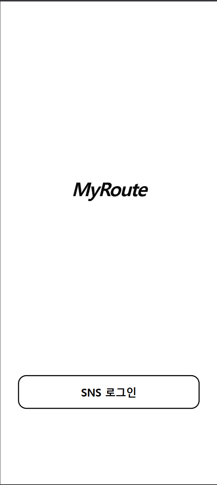
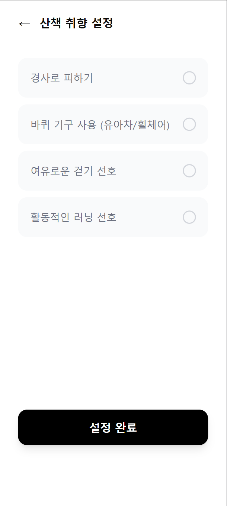
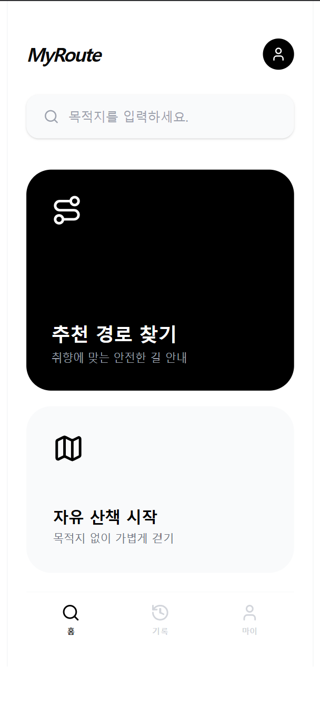
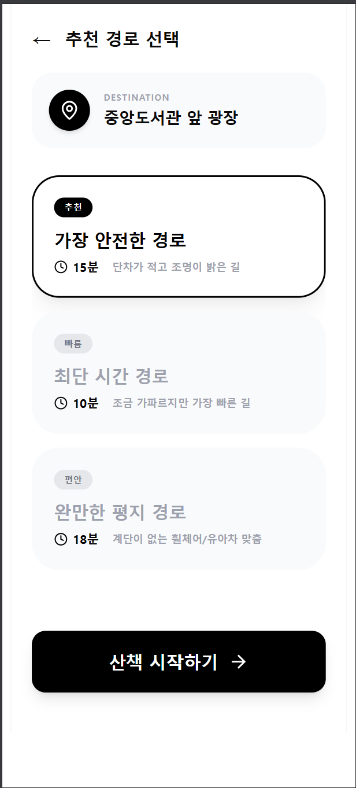
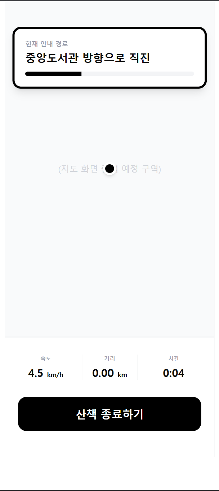
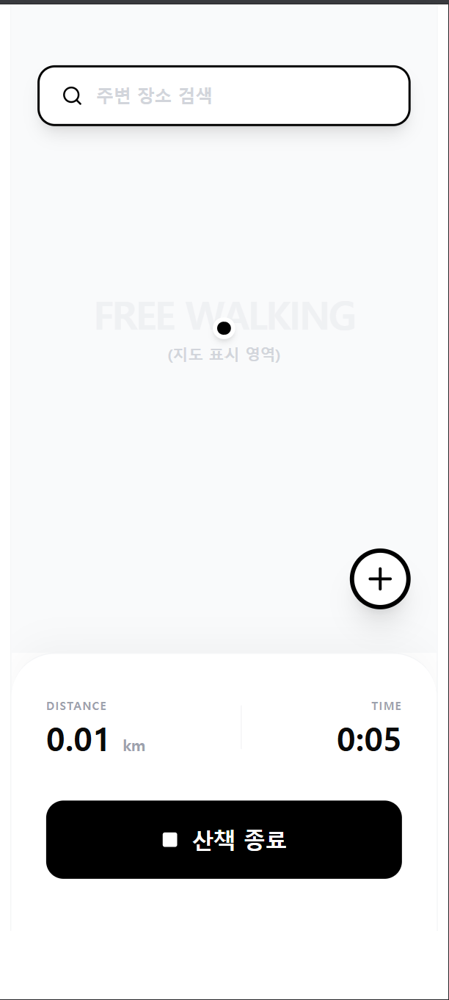
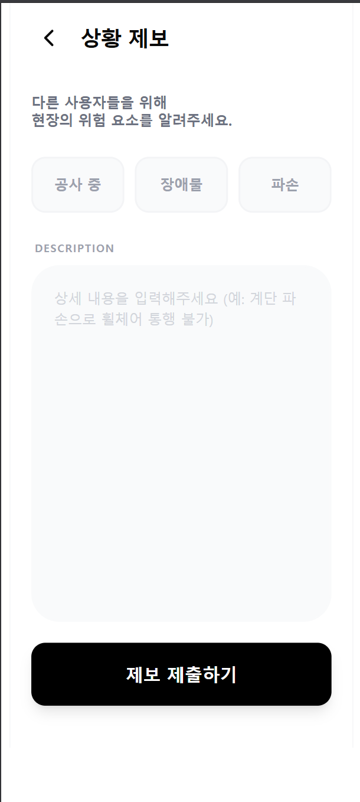
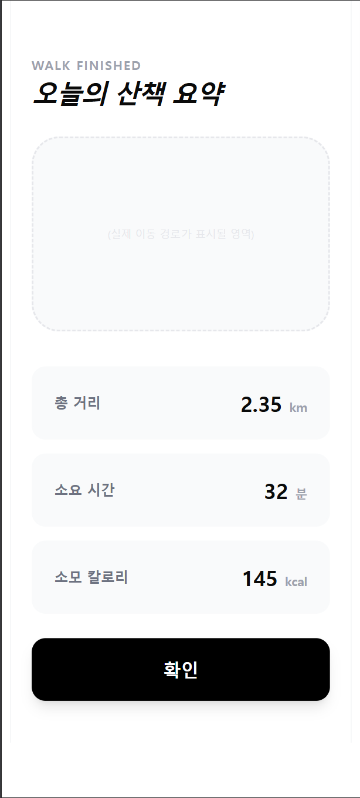
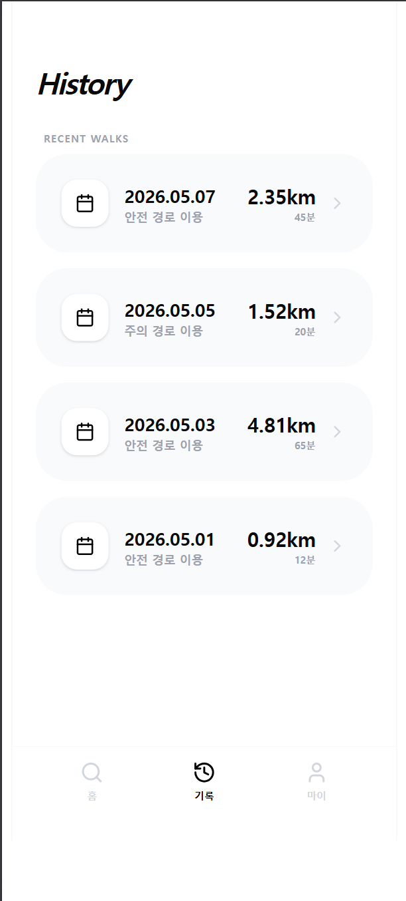
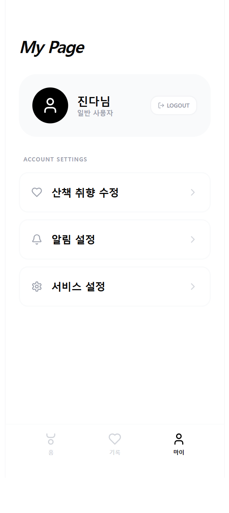

# **MyRoute** 
Analysis
 
 

 
 

**Student No: 22411863**

**Name: 진다혜**

**E-mail: jindahye0315_@naver.com**

 

## [ Revision history ]

Revision date|Version #|Description|Author
---|---|---|---
2026/05/01 | 0.0.1 | 양식 작성  | 진다혜
2026/05/05 | 0.1.0 | Use case analysis 작성 | 진다혜
2026/05/06 | 0.2.0 | Domain Analysis 파트 작성 완료 | 진다혜
2026/05/08 | 1.0.0 | 최종 문서 작성 완료 | 진다혜

 
 

## = Contents =
1. Introduction ........................................................................................................ 

2. Use case analysis .............................................................................................. 

3. Domain analysis ................................................................................................

4. User Interface prototype ............................................................................... 

5. Glossary ................................................................................................................

6. References ........................................................................................................... 

 
 

## 1. Introduction

### 1.1 Summary
본 문서는 사용자 맞춤형 보행 안전 내비게이션 서비스인 MyRoute의 요구사항 분석 및 시스템 설계를 기술한 상세 보고서이다. MyRoute는 보행 약자의 이동권 증진과 보행자의 안전한 산책 환경을 보장하기 위해 기획된 보행 전용 내비게이션 및 활동 기록 서비스이다.

본 서비스는 사용자의 현재 상황(휠체어, 유아차 사용 등)이나 선호도(경사도 기피, 조명이 밝은 길 등)를 입력받아 이를 경로 산출에 반영한다. 본 보고서는 이러한 기획 의도를 바탕으로 유스케이스 및 도메인을 분석하고, UI 프로토타입을 설명한다.

### 1.2 Conceptualization 문서 대비 변경 사항
초기 기획 이후, 분석 단계를 거치며 시스템의 전문성과 실현 가능성을 높이기 위해 다음과 같이 변경 및 고도화 작업을 수행하였다.

* **추천 방식의 구체화** 초기 기획 단계에서 정의했던 AI 최적 경로 추천이라는 추상적인 명칭을 분석 단계에서는 결정적 데이터 필터링 및 가중치 기반 추천으로 변경 및 구체화하였다.

* **기능적 구조의 계층화 (UC #5, #6 분리)** 기획 단계의 단일 추천 기능을 분석 단계에서는 '안전 경로 추천(UC #5)'과 이를 지원하는 '안전 필터 적용(UC #6)'이라는 하위 기능으로 분리하였다. 이는 알고리즘의 연산 과정을 세분화하여 시스템의 설계 구조를 명확히 하기 위함이다.

### 1.3 프로젝트의 주요 특징 (Prominent Features)

#### 1) 유용성 (Usefulness)
단순 최단 거리 탐색에서 벗어나 사용자의 신체 조건(휠체어, 유아차 등)과 보행 환경 선호도를 결합한 '안전 경로'를 제공함으로써 교통 약자의 실질적인 이동 편의를 증진한다.

#### 2) 의의 (Significance)
파편화된 공공 데이터와 실시간 사용자 제보(Crowdsourcing)를 결합하여 사회적 보행 안전망을 구축하고, 누구나 제약 없이 이동할 수 있는 배리어 프리(Barrier-free) 가치를 실현한다.

#### 3) 확장성 (Expandability)
수집된 보행 위험 데이터는 향후 지자체의 도로 정비 우선순위 결정의 기초 자료로 활용될 수 있으며, 러닝/등산 등 다양한 야간 야외 활동 서비스로 모델 확장이 용이하다.
 
 

## 2. Use case analysis

### 2.1 Use Case Diagram

*[그림 2-1] Use Case Diagram*
 

### 2.2 Use Case Description
<table>
  <thead><tr><th colspan="3" style="text-align:center;">Use case #1 : 로그인 (Login)</th></tr></thead>
  <tbody>
    <tr><td colspan="3"><b>GENERAL CHARACTERISTICS</b></td></tr>
    <tr><td width="25%">Summary</td><td colspan="2">사용자가 SNS 계정으로 MyRoute에 인증한다.</td></tr>
    <tr><td>Scope</td><td colspan="2">MyRoute</td></tr>
    <tr><td>Level</td><td colspan="2">User Level</td></tr>
    <tr><td>Author</td><td colspan="2">진다혜</td></tr>
    <tr><td>Last Update</td><td colspan="2">2026-05-05</td></tr>
    <tr><td>Status</td><td colspan="2">Analysis</td></tr>
    <tr><td>Primary Actor</td><td colspan="2">User</td></tr>
    <tr><td>Secondary Actor</td><td colspan="2">Auth Service</td></tr>
    <tr><td>Preconditions</td><td colspan="2">앱이 설치되어 있고 인터넷 연결이 가능해야 한다.</td></tr>
    <tr><td>Trigger</td><td colspan="2">메인 화면에서 "SNS 로그인"을 선택한다.</td></tr>
    <tr><td>Success Post Condition</td><td colspan="2">사용자가 인증된 상태로 메인 화면에 진입한다.</td></tr>
    <tr><td>Failed Post Condition</td><td colspan="2">로그인 화면에 머물고 오류 메시지가 표시된다.</td></tr>
    <tr><td colspan="3"><b>MAIN SUCCESS SCENARIO</b></td></tr>
    <tr><td style="text-align:center;">Step</td><td colspan="2">Action</td></tr>
    <tr><td style="text-align:center;">1</td><td colspan="2">사용자가 앱을 실행한다.</td></tr>
    <tr><td style="text-align:center;">2</td><td colspan="2">사용자가 "SNS 로그인"을 선택한다.</td></tr>
    <tr><td style="text-align:center;">3</td><td colspan="2">System이 Auth Service에 인증을 요청한다.</td></tr>
    <tr><td style="text-align:center;">4</td><td colspan="2">사용자가 SNS 계정 정보를 입력하고 동의한다.</td></tr>
    <tr><td style="text-align:center;">5</td><td colspan="2">Auth Service가 액세스 토큰을 반환한다.</td></tr>
    <tr><td style="text-align:center;">6</td><td colspan="2">System이 토큰을 저장하고 메인 화면을 표시한다.</td></tr>
    <tr><td colspan="3"><b>EXTENSION SCENARIOS</b></td></tr>
    <tr><td style="text-align:center;">Step</td><td colspan="2">Branching Action</td></tr>
    <tr><td rowspan="2" style="text-align:center;">4</td><td colspan="2">4a. 사용자가 인증을 거부한 경우</td></tr>
    <tr><td colspan="2">4a.1. System이 로그인 화면으로 복귀한다.</td></tr>
    <tr><td rowspan="3" style="text-align:center;">5</td><td colspan="2">5a. Auth Service 응답이 실패한 경우</td></tr>
    <tr><td colspan="2">5a.1. 네트워크 오류 메시지를 출력한다.</td></tr>
    <tr><td colspan="2">5a.2. 재시도 버튼을 제공한다.</td></tr>
    <tr><td colspan="3"><b>RELATED INFORMATION</b></td></tr>
    <tr><td>Performance</td><td colspan="2">≤ 3 Seconds</td></tr>
    <tr><td>Frequency</td><td colspan="2">High</td></tr>
    <tr><td>Concurrency</td><td colspan="2">Multiple</td></tr>
    <tr><td>Due Date</td><td colspan="2">2026-05-30</td></tr>
  </tbody>
</table>
 

<table>
  <thead><tr><th colspan="3" style="text-align:center;">Use case #2 : 회원가입 (Sign Up)</th></tr></thead>
  <tbody>
    <tr><td colspan="3"><b>GENERAL CHARACTERISTICS</b></td></tr>
    <tr><td width="25%">Summary</td><td colspan="2">신규 사용자가 SNS 계정으로 MyRoute에 회원으로 등록한다.</td></tr>
    <tr><td>Scope</td><td colspan="2">MyRoute</td></tr>
    <tr><td>Level</td><td colspan="2">User Level</td></tr>
    <tr><td>Author</td><td colspan="2">진다혜</td></tr>
    <tr><td>Last Update</td><td colspan="2">2026-05-05</td></tr>
    <tr><td>Status</td><td colspan="2">Analysis</td></tr>
    <tr><td>Primary Actor</td><td colspan="2">User</td></tr>
    <tr><td>Secondary Actor</td><td colspan="2">Auth Service</td></tr>
    <tr><td>Preconditions</td><td colspan="2">SNS 계정을 보유하고 있고 MyRoute에 미가입 상태이다.</td></tr>
    <tr><td>Trigger</td><td colspan="2">최초 SNS 로그인 시 시스템이 미등록 사용자임을 감지한다.</td></tr>
    <tr><td>Success Post Condition</td><td colspan="2">사용자 정보가 시스템에 저장되고 로그인 상태로 진입한다.</td></tr>
    <tr><td>Failed Post Condition</td><td colspan="2">회원가입이 취소되고 초기 화면으로 복귀한다.</td></tr>
    <tr><td colspan="3"><b>MAIN SUCCESS SCENARIO</b></td></tr>
    <tr><td style="text-align:center;">Step</td><td colspan="2">Action</td></tr>
    <tr><td style="text-align:center;">1</td><td colspan="2">사용자가 SNS 인증을 시도한다.</td></tr>
    <tr><td style="text-align:center;">2</td><td colspan="2">System이 미등록 사용자임을 확인한다.</td></tr>
    <tr><td style="text-align:center;">3</td><td colspan="2">System이 약관 동의 화면을 표시한다.</td></tr>
    <tr><td style="text-align:center;">4</td><td colspan="2">사용자가 약관에 동의한다.</td></tr>
    <tr><td style="text-align:center;">5</td><td colspan="2">System이 기본 프로필을 생성하여 DB에 저장한다.</td></tr>
    <tr><td style="text-align:center;">6</td><td colspan="2">System이 메인 화면을 표시한다.</td></tr>
    <tr><td colspan="3"><b>EXTENSION SCENARIOS</b></td></tr>
    <tr><td style="text-align:center;">Step</td><td colspan="2">Branching Action</td></tr>
    <tr><td rowspan="2" style="text-align:center;">4</td><td colspan="2">4a. 사용자가 약관에 동의하지 않은 경우</td></tr>
    <tr><td colspan="2">4a.1. System이 가입 절차를 중단하고 초기 화면으로 복귀한다.</td></tr>
    <tr><td rowspan="2" style="text-align:center;">5</td><td colspan="2">5a. DB 저장에 실패한 경우</td></tr>
    <tr><td colspan="2">5a.1. System이 오류 메시지를 출력하고 재시도 버튼을 제공한다.</td></tr>
    <tr><td colspan="3"><b>RELATED INFORMATION</b></td></tr>
    <tr><td>Performance</td><td colspan="2">≤ 3 Seconds</td></tr>
    <tr><td>Frequency</td><td colspan="2">Low</td></tr>
    <tr><td>Concurrency</td><td colspan="2">Multiple</td></tr>
    <tr><td>Due Date</td><td colspan="2">2026-05-30</td></tr>
  </tbody>
</table>
 

<table>
  <thead><tr><th colspan="3" style="text-align:center;">Use case #3 : 프로필 관리 (Manage Profile)</th></tr></thead>
  <tbody>
    <tr><td colspan="3"><b>GENERAL CHARACTERISTICS</b></td></tr>
    <tr><td width="25%">Summary</td><td colspan="2">사용자가 보행 선호도와 이동 제약 사항을 등록·수정한다.</td></tr>
    <tr><td>Scope</td><td colspan="2">MyRoute</td></tr>
    <tr><td>Level</td><td colspan="2">User Level</td></tr>
    <tr><td>Author</td><td colspan="2">진다혜</td></tr>
    <tr><td>Last Update</td><td colspan="2">2026-05-05</td></tr>
    <tr><td>Status</td><td colspan="2">Analysis</td></tr>
    <tr><td>Primary Actor</td><td colspan="2">User</td></tr>
    <tr><td>Secondary Actor</td><td colspan="2">없음</td></tr>
    <tr><td>Preconditions</td><td colspan="2">사용자가 로그인 상태이다.</td></tr>
    <tr><td>Trigger</td><td colspan="2">마이페이지에서 "프로필 수정"을 선택한다.</td></tr>
    <tr><td>Success Post Condition</td><td colspan="2">변경된 프로필 정보가 DB에 저장된다.</td></tr>
    <tr><td>Failed Post Condition</td><td colspan="2">변경 사항이 저장되지 않고 이전 상태가 유지된다.</td></tr>
    <tr><td colspan="3"><b>MAIN SUCCESS SCENARIO</b></td></tr>
    <tr><td style="text-align:center;">Step</td><td colspan="2">Action</td></tr>
    <tr><td style="text-align:center;">1</td><td colspan="2">사용자가 마이페이지에서 프로필 수정을 선택한다.</td></tr>
    <tr><td style="text-align:center;">2</td><td colspan="2">System이 현재 프로필 정보를 표시한다.</td></tr>
    <tr><td style="text-align:center;">3</td><td colspan="2">사용자가 항목(휠체어/유아차/반려동물 동반 등)을 선택 또는 해제한다.</td></tr>
    <tr><td style="text-align:center;">4</td><td colspan="2">사용자가 저장을 요청한다.</td></tr>
    <tr><td style="text-align:center;">5</td><td colspan="2">System이 변경 사항을 DB에 저장한다.</td></tr>
    <tr><td style="text-align:center;">6</td><td colspan="2">System이 저장 완료 메시지를 표시한다.</td></tr>
    <tr><td colspan="3"><b>EXTENSION SCENARIOS</b></td></tr>
    <tr><td style="text-align:center;">Step</td><td colspan="2">Branching Action</td></tr>
    <tr><td rowspan="2" style="text-align:center;">5</td><td colspan="2">5a. DB 저장에 실패한 경우</td></tr>
    <tr><td colspan="2">5a.1. System이 오류 메시지를 출력하고 변경 사항을 화면에 유지한 채 재시도 버튼을 제공한다.</td></tr>
    <tr><td colspan="3"><b>RELATED INFORMATION</b></td></tr>
    <tr><td>Performance</td><td colspan="2">≤ 3 Seconds</td></tr>
    <tr><td>Frequency</td><td colspan="2">Low</td></tr>
    <tr><td>Concurrency</td><td colspan="2">Multiple</td></tr>
    <tr><td>Due Date</td><td colspan="2">2026-05-30</td></tr>
  </tbody>
</table>
 

<table>
  <thead><tr><th colspan="3" style="text-align:center;">Use case #4 : 시설 탐색 (Browse Facilities)</th></tr></thead>
  <tbody>
    <tr><td colspan="3"><b>GENERAL CHARACTERISTICS</b></td></tr>
    <tr><td width="25%">Summary</td><td colspan="2">사용자가 현재 위치 주변의 편의 시설을 지도에서 확인한다.</td></tr>
    <tr><td>Scope</td><td colspan="2">MyRoute</td></tr>
    <tr><td>Level</td><td colspan="2">User Level</td></tr>
    <tr><td>Author</td><td colspan="2">진다혜</td></tr>
    <tr><td>Last Update</td><td colspan="2">2026-05-05</td></tr>
    <tr><td>Status</td><td colspan="2">Analysis</td></tr>
    <tr><td>Primary Actor</td><td colspan="2">User</td></tr>
    <tr><td>Secondary Actor</td><td colspan="2">External Map API, Public Data</td></tr>
    <tr><td>Preconditions</td><td colspan="2">사용자가 로그인 상태이고 위치 권한이 허용되어 있다.</td></tr>
    <tr><td>Trigger</td><td colspan="2">사용자가 지도 화면에 진입한다.</td></tr>
    <tr><td>Success Post Condition</td><td colspan="2">지도 위에 주변 시설 아이콘이 표시된다.</td></tr>
    <tr><td>Failed Post Condition</td><td colspan="2">지도 또는 시설 정보가 표시되지 않고 오류 메시지가 출력된다.</td></tr>
    <tr><td colspan="3"><b>MAIN SUCCESS SCENARIO</b></td></tr>
    <tr><td style="text-align:center;">Step</td><td colspan="2">Action</td></tr>
    <tr><td style="text-align:center;">1</td><td colspan="2">사용자가 지도 화면에 진입한다.</td></tr>
    <tr><td style="text-align:center;">2</td><td colspan="2">System이 사용자의 현재 위치를 획득한다.</td></tr>
    <tr><td style="text-align:center;">3</td><td colspan="2">System이 External Map API에 지도 타일을 요청한다.</td></tr>
    <tr><td style="text-align:center;">4</td><td colspan="2">System이 Public Data에서 주변 시설 좌표를 조회한다.</td></tr>
    <tr><td style="text-align:center;">5</td><td colspan="2">System이 지도 위에 시설 아이콘을 렌더링한다.</td></tr>
    <tr><td colspan="3"><b>EXTENSION SCENARIOS</b></td></tr>
    <tr><td style="text-align:center;">Step</td><td colspan="2">Branching Action</td></tr>
    <tr><td rowspan="2" style="text-align:center;">2</td><td colspan="2">2a. 위치 권한이 거부된 경우</td></tr>
    <tr><td colspan="2">2a.1. System이 권한 요청 안내를 표시하고 기본 위치(예: 서울 시청)를 기준으로 지도를 표시한다.</td></tr>
    <tr><td rowspan="2" style="text-align:center;">3</td><td colspan="2">3a. External Map API 응답이 실패한 경우</td></tr>
    <tr><td colspan="2">3a.1. System이 네트워크 오류 메시지와 재시도 버튼을 표시한다.</td></tr>
    <tr><td rowspan="2" style="text-align:center;">4</td><td colspan="2">4a. Public Data 응답이 없는 경우</td></tr>
    <tr><td colspan="2">4a.1. System이 시설 아이콘을 생략하고 지도만 표시한다.</td></tr>
    <tr><td colspan="3"><b>RELATED INFORMATION</b></td></tr>
    <tr><td>Performance</td><td colspan="2">≤ 3 Seconds</td></tr>
    <tr><td>Frequency</td><td colspan="2">High</td></tr>
    <tr><td>Concurrency</td><td colspan="2">Multiple</td></tr>
    <tr><td>Due Date</td><td colspan="2">2026-05-30</td></tr>
  </tbody>
</table>
 

<table>
  <thead><tr><th colspan="3" style="text-align:center;">Use case #5 : 안전 경로 추천 (Recommend Safe Route)</th></tr></thead>
  <tbody>
    <tr><td colspan="3"><b>GENERAL CHARACTERISTICS</b></td></tr>
    <tr><td width="25%">Summary</td><td colspan="2">사용자가 입력한 목적지까지 안전 정보가 반영된 보행 경로를 추천받는다.</td></tr>
    <tr><td>Scope</td><td colspan="2">MyRoute</td></tr>
    <tr><td>Level</td><td colspan="2">User Level</td></tr>
    <tr><td>Author</td><td colspan="2">진다혜</td></tr>
    <tr><td>Last Update</td><td colspan="2">2026-05-05</td></tr>
    <tr><td>Status</td><td colspan="2">Analysis</td></tr>
    <tr><td>Primary Actor</td><td colspan="2">User</td></tr>
    <tr><td>Secondary Actor</td><td colspan="2">External Map API, Public Data</td></tr>
    <tr><td>Preconditions</td><td colspan="2">사용자가 로그인 상태이고 출발지·목적지가 지정되어 있다.</td></tr>
    <tr><td>Trigger</td><td colspan="2">사용자가 "경로 검색"을 선택한다.</td></tr>
    <tr><td>Success Post Condition</td><td colspan="2">위험 구간이 시각적으로 표시된 추천 경로가 사용자에게 제시된다.</td></tr>
    <tr><td>Failed Post Condition</td><td colspan="2">추천 경로가 표시되지 않고 오류 메시지가 출력된다.</td></tr>
    <tr><td colspan="3"><b>MAIN SUCCESS SCENARIO</b></td></tr>
    <tr><td style="text-align:center;">Step</td><td colspan="2">Action</td></tr>
    <tr><td style="text-align:center;">1</td><td colspan="2">사용자가 출발지와 목적지를 입력한다.</td></tr>
    <tr><td style="text-align:center;">2</td><td colspan="2">사용자가 "경로 검색"을 선택한다.</td></tr>
    <tr><td style="text-align:center;">3</td><td colspan="2">System이 External Map API에 경로 데이터를 요청한다.</td></tr>
    <tr><td style="text-align:center;">4</td><td colspan="2">External Map API가 후보 경로를 반환한다.</td></tr>
    <tr><td style="text-align:center;">5</td><td colspan="2">System이 안전 필터 적용(UC #6)을 호출한다.</td></tr>
    <tr><td style="text-align:center;">6</td><td colspan="2">System이 위험 구간이 표시된 경로를 사용자에게 제시한다.</td></tr>
    <tr><td colspan="3"><b>EXTENSION SCENARIOS</b></td></tr>
    <tr><td style="text-align:center;">Step</td><td colspan="2">Branching Action</td></tr>
    <tr><td rowspan="3" style="text-align:center;">4</td><td colspan="2">4a. API가 경로를 찾지 못한 경우</td></tr>
    <tr><td colspan="2">4a.1. System이 "경로를 찾을 수 없음" 메시지를 표시한다.</td></tr>
    <tr><td colspan="2">4b. API 응답이 실패한 경우 → System이 네트워크 오류 메시지와 재시도 버튼을 표시한다.</td></tr>
    <tr><td rowspan="2" style="text-align:center;">5</td><td colspan="2">5a. 안전 데이터가 부재한 경우</td></tr>
    <tr><td colspan="2">5a.1. System이 기본 경로만 표시하고 "안전 정보 없음" 알림을 표시한다.</td></tr>
    <tr><td colspan="3"><b>RELATED INFORMATION</b></td></tr>
    <tr><td>Performance</td><td colspan="2">≤ 3 Seconds</td></tr>
    <tr><td>Frequency</td><td colspan="2">High</td></tr>
    <tr><td>Concurrency</td><td colspan="2">Multiple</td></tr>
    <tr><td>Due Date</td><td colspan="2">2026-05-30</td></tr>
  </tbody>
</table>
 

<table>
  <thead><tr><th colspan="3" style="text-align:center;">Use case #6 : 안전 필터 적용 (Apply Safety Filter)</th></tr></thead>
  <tbody>
    <tr><td colspan="3"><b>GENERAL CHARACTERISTICS</b></td></tr>
    <tr><td width="25%">Summary</td><td colspan="2">System이 외부 API로부터 받은 경로 위에 안전 정보를 매핑한다.</td></tr>
    <tr><td>Scope</td><td colspan="2">MyRoute</td></tr>
    <tr><td>Level</td><td colspan="2">Subfunction Level</td></tr>
    <tr><td>Author</td><td colspan="2">진다혜</td></tr>
    <tr><td>Last Update</td><td colspan="2">2026-05-05</td></tr>
    <tr><td>Status</td><td colspan="2">Analysis</td></tr>
    <tr><td>Primary Actor</td><td colspan="2">System</td></tr>
    <tr><td>Secondary Actor</td><td colspan="2">Public Data</td></tr>
    <tr><td>Preconditions</td><td colspan="2">외부 API로부터 수신된 경로 데이터가 시스템에 존재한다.</td></tr>
    <tr><td>Trigger</td><td colspan="2">UC #5(안전 경로 추천)에서 &lt;&lt;include&gt;&gt; 관계로 호출된다.</td></tr>
    <tr><td>Success Post Condition</td><td colspan="2">각 구간에 안전 점수가 부여된 경로가 반환된다.</td></tr>
    <tr><td>Failed Post Condition</td><td colspan="2">안전 점수가 매핑되지 않은 원본 경로가 반환된다.</td></tr>
    <tr><td colspan="3"><b>MAIN SUCCESS SCENARIO</b></td></tr>
    <tr><td style="text-align:center;">Step</td><td colspan="2">Action</td></tr>
    <tr><td style="text-align:center;">1</td><td colspan="2">System이 경로의 좌표 시퀀스를 추출한다.</td></tr>
    <tr><td style="text-align:center;">2</td><td colspan="2">System이 Public Data에서 해당 구간의 안전 데이터(경사도, 노면 상태 등)를 조회한다.</td></tr>
    <tr><td style="text-align:center;">3</td><td colspan="2">System이 각 구간에 안전 점수를 산출한다.</td></tr>
    <tr><td style="text-align:center;">4</td><td colspan="2">System이 위험 구간을 마킹한 경로 객체를 반환한다.</td></tr>
    <tr><td colspan="3"><b>EXTENSION SCENARIOS</b></td></tr>
    <tr><td style="text-align:center;">Step</td><td colspan="2">Branching Action</td></tr>
    <tr><td rowspan="2" style="text-align:center;">2</td><td colspan="2">2a. Public Data 응답이 없는 경우</td></tr>
    <tr><td colspan="2">2a.1. System이 안전 점수를 부여하지 않고 원본 경로를 그대로 반환한다.</td></tr>
    <tr><td colspan="3"><b>RELATED INFORMATION</b></td></tr>
    <tr><td>Performance</td><td colspan="2">≤ 3 Seconds</td></tr>
    <tr><td>Frequency</td><td colspan="2">High</td></tr>
    <tr><td>Concurrency</td><td colspan="2">Multiple</td></tr>
    <tr><td>Due Date</td><td colspan="2">2026-05-30</td></tr>
  </tbody>
</table>
 

<table>
  <thead><tr><th colspan="3" style="text-align:center;">Use case #7 : 실시간 안내 및 로깅 (Walk & Log)</th></tr></thead>
  <tbody>
    <tr><td colspan="3"><b>GENERAL CHARACTERISTICS</b></td></tr>
    <tr><td width="25%">Summary</td><td colspan="2">사용자가 보행하는 동안 System이 길을 안내하고 이동 경로를 기록한다.</td></tr>
    <tr><td>Scope</td><td colspan="2">MyRoute</td></tr>
    <tr><td>Level</td><td colspan="2">User Level</td></tr>
    <tr><td>Author</td><td colspan="2">진다혜</td></tr>
    <tr><td>Last Update</td><td colspan="2">2026-05-05</td></tr>
    <tr><td>Status</td><td colspan="2">Analysis</td></tr>
    <tr><td>Primary Actor</td><td colspan="2">User</td></tr>
    <tr><td>Secondary Actor</td><td colspan="2">External Map API</td></tr>
    <tr><td>Preconditions</td><td colspan="2">사용자가 로그인 상태이고 위치 권한이 허용되어 있다.</td></tr>
    <tr><td>Trigger</td><td colspan="2">사용자가 "보행 시작"을 선택한다.</td></tr>
    <tr><td>Success Post Condition</td><td colspan="2">보행 로그가 DB에 저장되고 종료 요약 화면이 표시된다.</td></tr>
    <tr><td>Failed Post Condition</td><td colspan="2">보행 로그가 저장되지 않거나 안내가 중단된다.</td></tr>
    <tr><td colspan="3"><b>MAIN SUCCESS SCENARIO</b></td></tr>
    <tr><td style="text-align:center;">Step</td><td colspan="2">Action</td></tr>
    <tr><td style="text-align:center;">1</td><td colspan="2">사용자가 "보행 시작"을 선택한다.</td></tr>
    <tr><td style="text-align:center;">2</td><td colspan="2">System이 GPS 추적을 시작한다.</td></tr>
    <tr><td style="text-align:center;">3</td><td colspan="2">System이 현재 위치를 지도에 실시간 표시한다.</td></tr>
    <tr><td style="text-align:center;">4</td><td colspan="2">System이 일정 주기로 GPS 좌표를 로그에 누적한다.</td></tr>
    <tr><td style="text-align:center;">5</td><td colspan="2">사용자가 "보행 종료"를 선택한다.</td></tr>
    <tr><td style="text-align:center;">6</td><td colspan="2">System이 누적 거리·시간·칼로리를 계산한다.</td></tr>
    <tr><td style="text-align:center;">7</td><td colspan="2">System이 종료 요약 화면을 표시하고 로그를 DB에 저장한다.</td></tr>
    <tr><td colspan="3"><b>EXTENSION SCENARIOS</b></td></tr>
    <tr><td style="text-align:center;">Step</td><td colspan="2">Branching Action</td></tr>
    <tr><td rowspan="2" style="text-align:center;">2</td><td colspan="2">2a. 위치 권한이 거부된 경우</td></tr>
    <tr><td colspan="2">2a.1. System이 보행 시작을 중단하고 권한 요청 안내를 표시한다.</td></tr>
    <tr><td rowspan="2" style="text-align:center;">3</td><td colspan="2">3a. GPS 신호가 약한 경우</td></tr>
    <tr><td colspan="2">3a.1. System이 "신호 약함" 알림을 표시하고 마지막 유효 좌표를 유지한다.</td></tr>
    <tr><td rowspan="2" style="text-align:center;">4</td><td colspan="2">4a. 사용자가 추천 경로를 이탈한 경우</td></tr>
    <tr><td colspan="2">4a.1. System이 이탈 알림을 표시하고 자유 산책 모드로 전환하며 로깅은 계속한다.</td></tr>
    <tr><td rowspan="2" style="text-align:center;">7</td><td colspan="2">7a. DB 저장에 실패한 경우</td></tr>
    <tr><td colspan="2">7a.1. System이 로그를 로컬에 임시 저장하고 네트워크 복구 시 자동 재전송한다.</td></tr>
    <tr><td colspan="3"><b>RELATED INFORMATION</b></td></tr>
    <tr><td>Performance</td><td colspan="2">≤ 3 Seconds</td></tr>
    <tr><td>Frequency</td><td colspan="2">High</td></tr>
    <tr><td>Concurrency</td><td colspan="2">Multiple</td></tr>
    <tr><td>Due Date</td><td colspan="2">2026-05-30</td></tr>
  </tbody>
</table>
 

<table>
  <thead><tr><th colspan="3" style="text-align:center;">Use case #8 : 변경사항 제보 (Report Change)</th></tr></thead>
  <tbody>
    <tr><td colspan="3"><b>GENERAL CHARACTERISTICS</b></td></tr>
    <tr><td width="25%">Summary</td><td colspan="2">사용자가 지도 정보와 다른 실제 도로 상황을 시스템에 제보한다.</td></tr>
    <tr><td>Scope</td><td colspan="2">MyRoute</td></tr>
    <tr><td>Level</td><td colspan="2">User Level</td></tr>
    <tr><td>Author</td><td colspan="2">진다혜</td></tr>
    <tr><td>Last Update</td><td colspan="2">2026-05-05</td></tr>
    <tr><td>Status</td><td colspan="2">Analysis</td></tr>
    <tr><td>Primary Actor</td><td colspan="2">User</td></tr>
    <tr><td>Secondary Actor</td><td colspan="2">Public Data</td></tr>
    <tr><td>Preconditions</td><td colspan="2">사용자가 로그인 상태이고 위치 권한이 허용되어 있다.</td></tr>
    <tr><td>Trigger</td><td colspan="2">사용자가 "제보하기"를 선택한다.</td></tr>
    <tr><td>Success Post Condition</td><td colspan="2">제보 내용이 DB에 저장되고 접수 완료 메시지가 표시된다.</td></tr>
    <tr><td>Failed Post Condition</td><td colspan="2">제보가 저장되지 않고 오류 메시지가 표시된다.</td></tr>
    <tr><td colspan="3"><b>MAIN SUCCESS SCENARIO</b></td></tr>
    <tr><td style="text-align:center;">Step</td><td colspan="2">Action</td></tr>
    <tr><td style="text-align:center;">1</td><td colspan="2">사용자가 "제보하기"를 선택한다.</td></tr>
    <tr><td style="text-align:center;">2</td><td colspan="2">System이 제보 양식을 표시한다.</td></tr>
    <tr><td style="text-align:center;">3</td><td colspan="2">사용자가 제보 유형(공사/장애물/시설 변경 등)과 설명을 입력한다.</td></tr>
    <tr><td style="text-align:center;">4</td><td colspan="2">System이 사용자의 현재 위치를 자동 첨부한다.</td></tr>
    <tr><td style="text-align:center;">5</td><td colspan="2">사용자가 제보를 제출한다.</td></tr>
    <tr><td style="text-align:center;">6</td><td colspan="2">System이 제보 데이터를 DB에 저장한다.</td></tr>
    <tr><td style="text-align:center;">7</td><td colspan="2">System이 접수 완료 메시지를 표시한다.</td></tr>
    <tr><td colspan="3"><b>EXTENSION SCENARIOS</b></td></tr>
    <tr><td style="text-align:center;">Step</td><td colspan="2">Branching Action</td></tr>
    <tr><td rowspan="2" style="text-align:center;">4</td><td colspan="2">4a. 위치 권한이 거부된 경우</td></tr>
    <tr><td colspan="2">4a.1. System이 사용자에게 위치를 직접 지정하도록 요청한다.</td></tr>
    <tr><td rowspan="2" style="text-align:center;">6</td><td colspan="2">6a. DB 저장에 실패한 경우</td></tr>
    <tr><td colspan="2">6a.1. System이 오류 메시지를 출력하고 입력 내용을 유지한 채 재시도 버튼을 제공한다.</td></tr>
    <tr><td colspan="3"><b>RELATED INFORMATION</b></td></tr>
    <tr><td>Performance</td><td colspan="2">≤ 3 Seconds</td></tr>
    <tr><td>Frequency</td><td colspan="2">Low</td></tr>
    <tr><td>Concurrency</td><td colspan="2">Multiple</td></tr>
    <tr><td>Due Date</td><td colspan="2">2026-05-30</td></tr>
  </tbody>
</table>
 

<table>
  <thead><tr><th colspan="3" style="text-align:center;">Use case #9 : 과거 이력 조회 (View Activity History)</th></tr></thead>
  <tbody>
    <tr><td colspan="3"><b>GENERAL CHARACTERISTICS</b></td></tr>
    <tr><td width="25%">Summary</td><td colspan="2">사용자가 과거 보행 활동 기록을 조회한다.</td></tr>
    <tr><td>Scope</td><td colspan="2">MyRoute</td></tr>
    <tr><td>Level</td><td colspan="2">User Level</td></tr>
    <tr><td>Author</td><td colspan="2">진다혜</td></tr>
    <tr><td>Last Update</td><td colspan="2">2026-05-05</td></tr>
    <tr><td>Status</td><td colspan="2">Analysis</td></tr>
    <tr><td>Primary Actor</td><td colspan="2">User</td></tr>
    <tr><td>Secondary Actor</td><td colspan="2">없음</td></tr>
    <tr><td>Preconditions</td><td colspan="2">사용자가 로그인 상태이고 저장된 보행 로그가 1개 이상 존재한다.</td></tr>
    <tr><td>Trigger</td><td colspan="2">사용자가 마이페이지에서 "활동 이력"을 선택한다.</td></tr>
    <tr><td>Success Post Condition</td><td colspan="2">사용자가 선택한 보행 기록의 상세 정보가 표시된다.</td></tr>
    <tr><td>Failed Post Condition</td><td colspan="2">이력 목록이 표시되지 않고 오류 또는 안내 메시지가 출력된다.</td></tr>
    <tr><td colspan="3"><b>MAIN SUCCESS SCENARIO</b></td></tr>
    <tr><td style="text-align:center;">Step</td><td colspan="2">Action</td></tr>
    <tr><td style="text-align:center;">1</td><td colspan="2">사용자가 "활동 이력"을 선택한다.</td></tr>
    <tr><td style="text-align:center;">2</td><td colspan="2">System이 DB에서 사용자의 보행 로그 목록을 조회한다.</td></tr>
    <tr><td style="text-align:center;">3</td><td colspan="2">System이 날짜순으로 정렬된 목록을 표시한다.</td></tr>
    <tr><td style="text-align:center;">4</td><td colspan="2">사용자가 특정 항목을 선택한다.</td></tr>
    <tr><td style="text-align:center;">5</td><td colspan="2">System이 해당 보행의 상세 정보(경로·거리·시간)를 표시한다.</td></tr>
    <tr><td colspan="3"><b>EXTENSION SCENARIOS</b></td></tr>
    <tr><td style="text-align:center;">Step</td><td colspan="2">Branching Action</td></tr>
    <tr><td rowspan="3" style="text-align:center;">2</td><td colspan="2">2a. 저장된 로그가 없는 경우</td></tr>
    <tr><td colspan="2">2a.1. System이 "기록이 없습니다" 메시지를 표시한다.</td></tr>
    <tr><td colspan="2">2b. DB 조회에 실패한 경우 → System이 오류 메시지와 재시도 버튼을 표시한다.</td></tr>
    <tr><td colspan="3"><b>RELATED INFORMATION</b></td></tr>
    <tr><td>Performance</td><td colspan="2">≤ 3 Seconds</td></tr>
    <tr><td>Frequency</td><td colspan="2">Medium</td></tr>
    <tr><td>Concurrency</td><td colspan="2">Multiple</td></tr>
    <tr><td>Due Date</td><td colspan="2">2026-05-30</td></tr>
  </tbody>
</table>

 
 

## 3. Domain Analysis
Class|Description
---|---
User | 서비스에 가입한 사용자이다. 카카오 OAuth 등의 SNS 인증을 통해 식별되며 자신의 프로필, 보행 로그, 제보 내역 등을 관리한다.
UserPreference|사용자의 보행 특성 및 이동 제약 사항 등을 관리한다. 계단, 경사로 등이 포함되며 안전 경로 추천 시 가중치로 활용된다.
Route|목적지까지의 이동 경로 정보를 담는다. 지도의 데이터와 시스템의 안전 필터가 결합된 최종 결과물이다. 실제 이동 경로가 아닌 추천 경로이다.
RouteSegment|전체 경로를 구성하는 단위 도로 구간이다. 각 구간의 경사도나 노면 상태 등 물리적 데이터를 안전 필터 로직과 대조하는 최소 단위가 된다.
SafetyData|공공 데이터로부터 수집한 도로의 객관적인 환경 정보이다. 특정 구간의 경사도, 장애물 유무 등 UserPreference와 비교될 데이터이다.
WalkingLog|보행 완료 후 생성되는 활동 통계이다. 이동 거리와 소요 시간 등을 계산하여 사용자의 과거 이력으로 저장하며 실제 이동 궤적을 기록한다.
GPSPoint|보행 중 실시간으로 수집되는 위도와 경도 데이터이다. 시간 순으로 연결되어 WalkingLog의 구체적인 이동 궤적을 형성한다.
Facility|지도상에 표시되는 편의 시설 정보이다. 보행 약자에게 필요한 시설의 카테고리와 위치를 분류하여 제공한다.
Report|사용자가 직접 제보한 도로 현황 데이터이다. 실제 도로 상황과 시스템 데이터 간의 차이를 보완하는 역할을 수행한다.
Location|시스템 전반에서 재사용되는 위치 정보 클래스이다. 좌표값 처리 기능을 캡슐화하여 위경도 정보를 일관되게 관리한다.

 
 

## 4. User Interface prototype
본 절에서는 MyRoute 서비스의 핵심 기능을 구현한 UI 프로토타입을 제시한다. 모든 인터페이스는 간단하게 사용자가 직관적으로 조작이 가능하도록 설계되었다.

### 4.1 Login (로그인)
  
서비스 진입 시 가장 먼저 마주하는 화면으로, SNS 로그인 버튼으로 로그인을 시도할 수 있다(Use Case #1).

### 4.2 Sign Up (회원가입)
 
신규 사용자의 회원가입 화면이다(Use Case #2). 

### 4.3 Preferences (산책 취향 설정)
 
사용자의 보행 제약 사항(경사로 기피, 바퀴 기구 사용 등)을 사전에 선택하게 하는 화면이다(Use Case #3). 이 데이터는 사용자 맞춤형 안전 경로 추천에 활용된다.

### 4.4 Home (메인 대시보드)
 
서비스의 핵심 기능(추천 경로/자유 산책)을 두 개를 선택할 수 있다(Use Case #4, #5). 상단에는 현재 목적지를 확인 및 수정할 수 있으며, 하단 탭바를 통해 홈, 기록, 마이페이지 간의 빠른 이동이 가능하다.

### 4.5 Route Selection (추천 경로 선택)
 
목적지 입력 후 제공되는 후보 경로 리스트이다(Use Case #5). 각 후보 경로별 예상 소요 시간과 경로의 특징(태그 및 설명)을 제공하며, 사용자는 본인의 우선순위(최단 시간, 완만한 평지 등)에 따라 최적의 경로를 선택할 수 있다.

### 4.6 Navigation (실시간 산책 안내)
 
선택된 경로를 따라 실시간 안내가 이루어지는 화면이다(Use Case #7). 상단에서 목적지를(예: 중앙도서관 방향으로 직진)를 표시한다. 하단에서는 현재 속도, 거리, 시간 데이터를 실시간으로 트래킹하여 사용자에게 제공한다.

### 4.7 SearchMap (자유 산책 시작)
 
목적지 없이 원하는 경로를 원할 때 사용하는 화면으로 홈 화면에서 "자유 산책 시작" 버튼을 누르면 시작된다(Use Case #7). 하단에서는 현재 속도, 거리, 시간 데이터를 실시간으로 트래킹하여 사용자에게 제공한다. 우측 하단의 (+) 버튼을 통해 현장의 위험 요소를 즉시 제보할 수 있는 화면으로 넘어갈 수 있다(Use Case #8).

### 4.8 Issue Report (상황 제보)
 
보행 중 발견한 현장의 위험 요소(공사, 파손 등)를 시스템에 제보하는 화면이다(Use Case #8). 제보 유형(공사 중, 장애물, 파손)을 버튼 형태로 직관적으로 선택하고, 텍스트 입력을 통해 다른 사용자들에게 최신 안전 데이터를 공유하는 기능을 수행한다.

### 4.9 Summary (산책 종료 요약)
 
산책 종료 후 생성되는 활동 통계 화면이다(Use Case #7). 실제 이동 궤적을 요약해서 보여주며 총 거리, 소요 시간, 소모 칼로리 데이터를 제시한다. 

### 4.10 History (활동 이력 조회)
 
과거 보행 활동 기록을 날짜순으로 나열한 화면이다(Use Case #9). 각 기록은 카드 형태로 구성되어 날짜, 거리, 소요 시간, 이용 경로의 안전 상태를 빠르게 확인할 수 있으며, 지속적인 서비스 이용을 독려하는 아카이빙 역할을 수행한다.

### 4.11 My Page (마이페이지)
 
사용자 계정 정보와 서비스 설정을 관리하는 통합 공간이다(Use Case #3). 로그아웃, 산책 취향 수정, 알림 설정, 서비스 설정 메뉴를 사용할 수 있다.

 
 

## 5. Glossary
용어 | 설명
---|---
**External Map API** | 지도 타일 렌더링 및 경로 탐색 로직을 제공하는 외부 인터페이스(카카오맵, 구글맵 등)이다.
**Public Data (공공 데이터)** | 정부나 공공기관이 보유한 도로 경사도, 장애인 편의시설 위치 등 시스템의 안전 필터 구현을 위한 데이터이다.

 
 

## 6. References
참고 앱: 삼성 헬스, Nike Rum Club