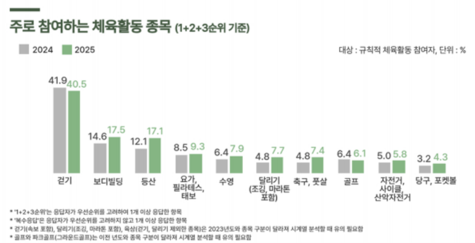
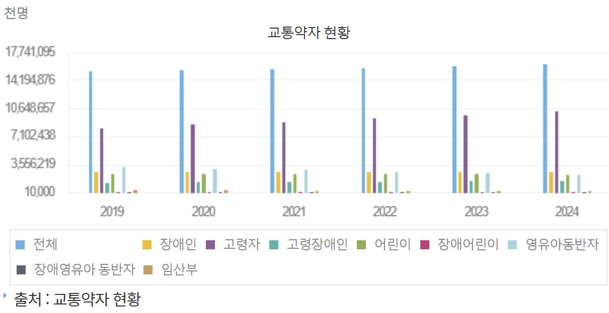
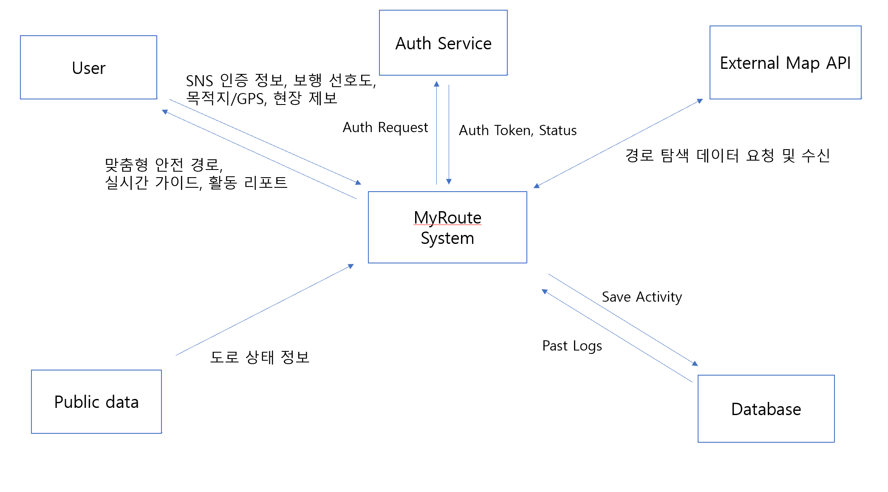

# **MyRoute** Conceptualization
 
 

 
 

**Student No: 22411863**

**Name: 진다혜**

**E-mail: jindahye0315_@naver.com**

 

## [ Revision history ]

Revision date|Version #|Description|Author
---|---|---|---
2025/03/21 | 0.1 | 초안 작성 완료 | 진다혜
2025/03/23 | 0.2 | use case 수정 | 진다혜
2025/03/25 | 1.0 | 오타 수정 및 최종 검토 | 진다혜
2026/06/04 | 2.0 | 프로젝트 진행 상황에 따라 3장과 4장 수정 | 진다혜

 
 

## = Contents =
1. Business purpose .................................................................................. 

2. System context diagram ..................................................................... 

3. Use case list .............................................................................................

4. Concept of operation .......................................................................... 

5. Problem statement ............................................................................... 

6. Glossary ..................................................................................................... 

7. References ................................................................................................. 

 
 

## 1. Business Purpose
### 1.1 Project Background & Motivation
현대 사회에서 산책은 건강 관리와 스트레스 해소를 위한 필수 활동이다. 문화체육관광부의 2025 국민생활체육조사에 따르면 주로 참여하는 체육활동 종목의 40.5%가 걷기, 17.1%가 등산, 7.7%가 달리기(조깅, 마라톤 포함), 5.8%가 자전거, 사이클, 산악자전거로 약 70% 이상이 야외 활동 중심의 운동이다(아래 [그림 1-1] 참조). 하지만 기존의 지도 서비스는 모든 사용자에게 최단 거리 위주의 경로만을 제공한다.   
또한 국토교통부의 교통약자 현황에 따르면 교통약자 인구는 매년 증가하고 있다. 2024년 기준 교통약자 인구는 약 1,612만 명으로 전체 인구의 31.5%를 차지하며, 국민 3명 중 1명이 이동에 제약을 느끼고 있는 상황이다(아래 [그림 1-2] 참조). 그러나 이들이 필요로 하는 경사로 유무, 계단 없는 길 등의 정밀한 정보는 파편화되어 있어 접근이 어렵다. 이에 각자의 요구사항에 맞는 경로를 추천하고 기록하여 관리할 수 있는 서비스를 구상했다. 이 서비스를 통해 휠체어, 유아차, 노인 등 교통약자를 위한 경로뿐만 아니라 도심, 공원, 강변 등 각자의 취향에 맞는 경로를 추천해주어 맞춤형 경로를 추천할 수 있도록 한다. 

*[그림 1-1] 2025 국민생활체육조사 참여 종목 현황*

*[그림 1-2] 연도별 총인구 대비 교통약자 현황 (2019-2024)*

### 1.2 Goal
- **맞춤형 경로 추천 및 가이드** : 사용자의 개별 선호 취향(경사로 회피, 바퀴 기구 이용 플래그 등)과 공공데이터 인프라 정보를 융합 연산하여 최적화된 안전 경로 및 실시간 내비게이션을 제공한다.
- **활동 로그 관리 및 제보** : 산책로 주행 데이터를 체계적으로 트래킹하여 개인화된 이력을 관리하고, 현장의 위험 요소를 실시간 제보하여 데이터 공백을 능동적으로 보완한다.

### 1.3 Target Market
- 자신의 활동(러닝, 산책, 등산 등)을 데이터로 기록 및 관리하며, 지형(평지, 강변, 산 등)이나 주변 환경에 대한 고유한 취향을 바탕으로 맞춤형 경로 추천을 원하는 사용자.
- **교통약자** : 무장애 경로 정보 및 이동 편의성이 필수적인 영유아차(유모차) 동반 보호자 및 휠체어 이용자.

 
 

## 2. System Context Diagram

### 2.1 Diagram

*[그림 2-1] Context Diagram*

### 2.2 Description of Terms in Diagram
- **MyRoute System** : 클라이언트와 백엔드 서버, 로컬 데이터베이스가 결합하여 사용자 취향 반영 경로 연산 및 데이터 관리를 수행하는 시스템.
- **User** : 맞춤형 보행 선호도를 설정하고 시스템에 경로 탐색을 요청하며, 실시간 위치 정보(GPS) 송신 및 위험 요소 제보를 수행하는 주체.
- **Auth Service** : 카카오 로그인 연동을 통해 사용자 인증 요청을 위임 처리하고 고유 식별 토큰 및 프로필을 중계하는 외부 인증 서비스.
- **External Map API** : 화면 상에 실시간 지도를 렌더링하고 경로 폴리라인 및 POI 좌표 데이터를 매핑하기 위한 Kakao Map 외부 오픈 API.
- **Public Data** : 행정안전부 및 국토교통부 등 국가 기관에서 개방하는 보행 안전 인프라, 도로 경사도, 배리어프리 정보를 제공하는 정부 공공데이터포털 Open API 소스.

 
 

## 3. Use case list

### 1) 로그인 (Login)
| Actor | User, Auth Service |
|---|---|
| Description | 사용자가 외부 카카오 계정 인증 시스템을 통해 마이루트 서비스에 안전하게 접근할 수 있는 정식 세션 권한을 확보한다. |

### 2) 회원가입 (Sign Up)
| Actor | User, Auth Service, Database |
|---|---|
| Description | 최초 인증 시 시스템 데이터베이스에 등록되지 않은 신규 회원으로 판명될 경우 진행된다. 고유 닉네임 설정 및 개인 맞춤형 산책 취향 필터(경사로 회피 유무, 바퀴 기구 사용 등)를 입력받아 데이터베이스의 users 테이블에 새롭게 등록한다. |

### 3) 안전 경로 추천 및 가이드 (Recommend Route & Navigate)
| Actor | User, External Map API, Public Data, Database |
|---|---|
| Description | 사용자가 설정한 보행 취향 가중치 필터와 공공데이터의 도로 환경 정보(경사도 등)를 융합 연산하여 최적의 추천 경로 리스트를 지도에 렌더링한다. 산책 시작 시 실시간 타이머 및 보행 데이터를 정밀 트래킹(로깅)하며, 종료 시 요약 리포트를 출력하고 최종 주행 이력을 저장한다. |

### 4) 자유 산책 및 위험 제보 (Free Walking & Issue Report)
| Actor | User, External Map API, Database |
|---|---|
| Description | 별도의 목적지 설정 없이 지도 화면 상에서 실시간으로 이동 시간 및 거리를 축적하며 자유 산책을 수행한다. 보행 중 실제 도로의 갑작스러운 공사, 파손 등 지도에 미반영된 현장 위험 요소를 발견 시 카테고리별로 선택 및 입력하여 데이터베이스에 영구 적재(제보)한다. |

### 5) 과거 이력 조회 (View Activity History)
| Actor | User, Database |
|---|---|
| Description | 데이터베이스에 축적된 사용자의 지난 과거 보행 활동 기록 로그들을 호출하여 목록 리스트 형태로 화면에 출력한다. |

### 6) 프로필 및 취향 수정 (Manage Profile & Preferences)
| Actor | User, Database |
|---|---|
| Description | 마이페이지 시스템을 통해 기존에 등록되어 있는 사용자의 상태 정보를 확인하고, 선호 사항의 변동에 따라 닉네임 및 산책 취향 설정을 수정하여 갱신한다. |

 
 

## 4. Concept of operation

### 1) 로그인 (Login)
| | |
|---|---|
| **Purpose** | 외부 소셜 연동을 통해 등록된 사용자인지 검증하고 개인화된 보안 세션을 제공한다. |
| **Approach** | 사용자가 카카오 계정으로 로그인을 시도하면 KakaoCallback 컴포넌트가 인가 코드를 가로채 백엔드 AuthRouter로 위임하며 사용자 고유 식별 세션을 확립한다. |
| **Dynamics** | 어플리케이션 구동 및 초기 진입 시 실행 |
| **Goals** | 간편하고 안전한 사용자 소셜 인증 체계 유지 및 개인 세션 보장 |

### 2) 회원가입 (Sign Up)
| | |
|---|---|
| **Purpose** | 신규 사용자의 식별 정보와 초기 개인화 보행 취향 데이터를 시스템 데이터베이스에 안착시킨다. |
| **Approach** | SignUp 컴포넌트에서 중복 없는 고유 닉네임을 설정받고, Preferences 화면 라우팅을 유도하여 보행 특성을 규정함으로써 users 테이블에 레코드를 적재한다. |
| **Dynamics** | 소셜 인증 후 연동 데이터 기반 신규 회원 감지 시 유입 |
| **Goals** | 맞춤형 경로 산출의 근거가 되는 정밀 온보딩 데이터 확보 |

### 3) 안전 경로 추천 및 가이드 (Recommend Route & Navigate)
| | |
|---|---|
| **Purpose** | 개인별 보행 특성을 반영한 안전 경로를 화면에 가이드하고 활동 결과 데이터를 계량화하여 관리한다. |
| **Approach** | RouteSelection 컴포넌트가 백엔드 가중치 연산 엔진에 질의하여 공공데이터 기반 안전 통행로를 도출해 내고, Navigation 컴포넌트의 타이머 루프를 통해 실시간 트래킹을 수행한다. 종료 시 Summary 컴포넌트가 요약 결과를 연산하여 이력을 최종 커밋한다. |
| **Dynamics** | 메인 홈 화면에서 '추천 경로 찾기' 버튼을 트리거하여 산책을 시작하고 종료할 때까지의 과정 |
| **Goals** | 신뢰도 높은 개인 맞춤형 경로 산출 및 정밀한 실시간 주행 활동 로그 적재 |

### 4) 자유 산책 및 위험 제보 (Free Walking & Issue Report)
| | |
|---|---|
| **Purpose** | 목적지 없는 자유로운 보행 활동을 지원하는 동시에 현장 실황 데이터를 수집하여 데이터 공백을 제거한다. |
| **Approach** | SearchMap 컴포넌트의 지도 뷰 위에서 이동 데이터를 누적 연산하며, 위험물 발견 시 IssueReport 컴포넌트로 전이하여 민원 카테고리와 상세 설명을 백엔드 RouteRouter를 거쳐 데이터베이스에 적재한다. |
| **Dynamics** | 메인 홈 화면에서 '자유 산책 시작' 트리거 후 현장 돌발 위험 요소를 식별했을 때 수행 |
| **Goals** | 보행의 자율성 보장 및 집단지성 크라우드소싱 기반의 실시간 도로 최신성 확보 |

### 5) 과거 이력 조회 (View Activity History)
| | |
|---|---|
| **Purpose** | 사용자가 자신의 누적 활동 이력을 직관적으로 파악하여 지속적인 동기를 유도한다. |
| **Approach** | History 컴포넌트 활성화 시 백엔드 RouteRouter를 경유하여 SQLite 데이터베이스에 질의를 요청하고, 반환된 활동 정보 JSON 객체 어레이를 리스트 뷰 형태로 매핑 출력한다. |
| **Dynamics** | 하단 탭바 메뉴에서 '기록' 아이콘을 클릭하여 조회 모드로 진입할 때 작동 |
| **Goals** | 정형화된 활동 로그 관리 시스템을 통한 데이터 시각화 리포트 표출 |

### 6) 프로필 및 취향 수정 (Manage Profile & Preferences)
| | |
|---|---|
| **Purpose** | 사용자의 가변적인 신체 환경 및 이동 제약 요구사항 변동을 시스템에 유연하게 동기화한다. |
| **Approach** | MyPage 컴포넌트에서 사용자의 현재 상태를 바인딩하고, 수정 메뉴 진입 시 Preferences 컴포넌트의 다중 플래그 선택 폼을 재활용하여 백엔드 AuthRouter에 SQL UPDATE 트랜잭션을 실행한다. |
| **Dynamics** | 하단 탭바의 '마이' 메뉴 진입 후 '산책 취향 수정' 로직을 실행할 때 발생 |
| **Goals** | 실시간 수정 처리를 통한 사용자 개인화 선호 필터의 유연성 및 최신성 유지 |

 
 

## 5. Problem statement
### Overview
본 서비스는 사용자의 고유한 취향과 보행 환경을 반영하여 최적의 경로를 추천하고, 이동 데이터를 체계적으로 관리하는 서비스이다. 단순한 최단 거리 안내를 넘어 도로 환경을 반영하고 개인의 상황과 선호에 맞춘 경험을 제공하기 위해 시스템 구축 과정에서 반드시 고려해야 할 기술적 난제와 품질 기준이 존재한다. 아래에서는 시스템이 해결해야 할 주요 문제점과 비기능적 요구사항들이다.

### 5.1 Technical Problems
- **Problem #1: 복합 가중치 기반 경로 탐색 연산 최적화**   
본 시스템은 기존 상용 맵 서비스와 달리 공공데이터의 경사도, 계단 유무, 바퀴 이동 인프라 정보와 사용자가 등록한 선호도 플래그 값을 융합 계산해야 한다. 

- **Problem #2: 제보 데이터와 공공데이터의 정보가 다른 경우** 
정부 공공데이터는 주기적으로 갱신되나 돌발적인 노면 파손이나 당일 공사 실황을 실시간 반영하지 못한다. 이를 보완하기 위해 제보 데이터와 기존 공공데이터 소스가 상충할 때, 어떤 데이터에 우선순위를 부여해 경로 필터에 매핑할 것인지에 대한 정합성 제어 기준 및 허위 제보 필터링이 요구된다.

- **Problem #3: 정밀 보행 위치 인식 오차 보정 및 예외 처리** 
보행자 내비게이션은 차량에 비해 이동 속도가 현저히 느리며 횡단보도, 이면도로 진입 등 미세한 이동 변화를 정밀 포착해야 한다. 고층 빌딩 밀집 구역이나 음영 지역 진입 시 발생하는 클라이언트 측 GPS 신호 수신 왜곡 현상을 매끄럽게 필터링하고 타이머와 거리 누적 계산의 무결성을 유지할 보정 알고리즘이 필요하다.

- **Problem #4: 이동 이력 데이터 보안 및 프라이버시 보호** 
사용자의 실시간 보행 GPS 좌표 및 상세 이동 궤적은 개인의 일상적인 생활 패턴과 동선이 완전히 노출되는 민감 정보이다. SQLite 데이터베이스 파일 및 네트워크 통신 패킷 상에서 이러한 민감 정보가 탈취되거나 비인가 사용자에게 노출되지 않도록 데이터 격리 및 철저한 세션 제어 아키텍처가 구현되어야 한다.

### 5.2 Non-Functional Requirements (NFRs)
- **성능 (Performance)** : 클라이언트의 가중치 기반 추천 경로 탐색 요청 시 최종 결과 산출 및 지도 표출까지의 응답 시간은 최대 3초 이내로 완료되어야 한다.
- **사용성 (Usability)** : 핵심 기능(추천 경로 탐색, 자유 산책 시작, 위험 제보, 이력 확인)은 하단 내비게이션 탭바 및 메인 홈 화면에서 최대 3회 이내의 터치 액션으로 진입할 수 있어야 한다.
- **보안성 (Security)** : 로컬 브라우저 저장소(LocalStorage) 및 데이터베이스에 적재되는 모든 사용자 고유 식별값과 민감 이동 로그는 유효한 토큰 인증을 거친 안전한 정식 세션 상태에서만 호출 가능해야 한다.
- **안정성 (Reliability)** : 경량 파일 임베디드 데이터베이스(SQLite3) 운영 환경 하에서 동시다발적인 트랜잭션 요청이 인입되더라도 데이터 교착 상태(Deadlock) 없이 안정적인 영속성 처리가 보장되어야 한다.

 
 

## 6. Glossary
| 용어 | 설명 |
|---|---|
| **UML (Unified Modeling Language)** | 소프트웨어 시스템의 산출물을 시각화, 명세화, 문서화하기 위해 사용하는 공학 표준 객체 모델링 표기법 |
| **주행 로그 (Walk Log)** | 사용자가 실제로 보행 이동하며 누적된 실시간 GPS 좌표 데이터, 이동 거리(Float), 소요 시간(Integer) 등의 활동 결과물 |
| **위험 제보 (Issue Report)** | 도로 공사, 싱크홀, 계단 유무 등 공공 데이터 백로그에 미반영된 현장 리스크를 사용자가 직관적으로 입력해 시스템 데이터에 기여하는 크라우드소싱 기능 |
| **POI (Point of Interest)** | 지도 화면 상에 점형 기호로 매핑되는 특정 관심 시설물 혹은 장소 데이터를 뜻하며, 본 서비스에서는 엘리베이터, 무장애 화장실 등 보행 편의 인프라를 지칭함 |
| **Public Data (공공데이터)** | 정부 부처 및 공공기관이 개방한 경사도 데이터, 교통약자 이동 안전 지표 등 연산 가중치의 근간이 되는 원천 개방 데이터 소스 |
| **Kakao Map API** | 클라이언트 디바이스 화면에 실시간 오픈스리트 맵을 렌더링하고 경로 폴리라인 및 위험 마커를 매핑 표출하기 위해 도입한 공간 정보 외부 인터페이스 |
| **LocalStorage** | 사용자의 로그인이 성립된 이후 발급된 유저 고유 세션 데이터와 닉네임 상태를 브라우저 내에 반영구적으로 적재 및 동기화하기 위한 클라이언트 측 웹 저장소 공간 |

 
 

## 7. References
- [1] 문화체육관광부, "2025 국민생활체육조사 통계 보고서", 야외 체육활동 유입 추이 분석 사양.
- [2] 국토교통부, "2024년도 전국 교통약자 이동편의 실태조사 현황 연구 보고서".
- [3] Object Management Group (OMG), "Unified Modeling Language (UML) Specification v2.5.1", 정적/동적 다이어그램 표준 사양서.
- [4] 카카오 디벨로퍼스 (Kakao Developers), "Kakao OAuth 2.0 및 Web Map API 오픈 인터페이스 명세서", https://developers.kakao.com
- [5] 행정안전부 공공데이터포털, "전국 무장애 보행로 및 고정밀 지형 경사도 오픈 API 표준 포맷 데이터셋", https://www.data.go.kr