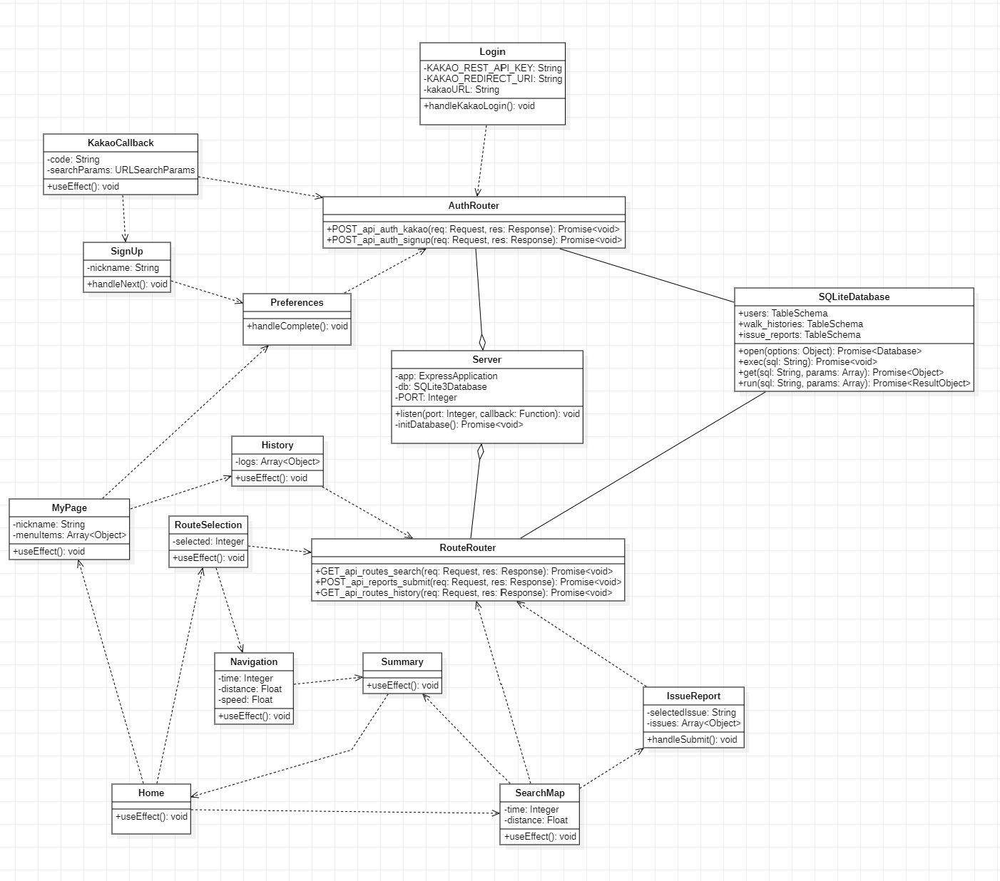
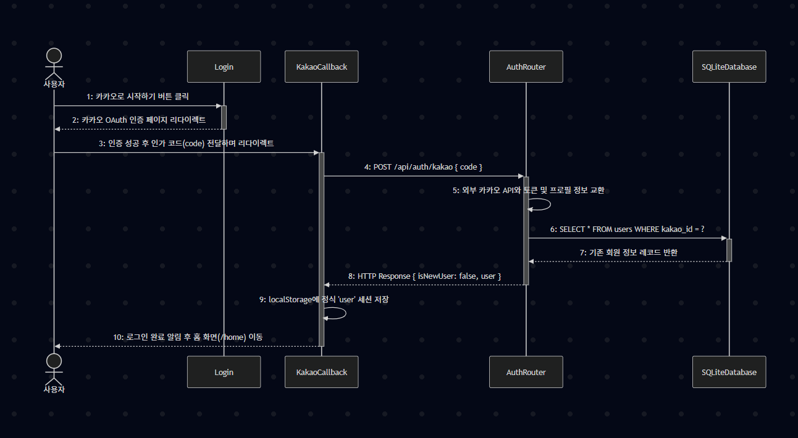
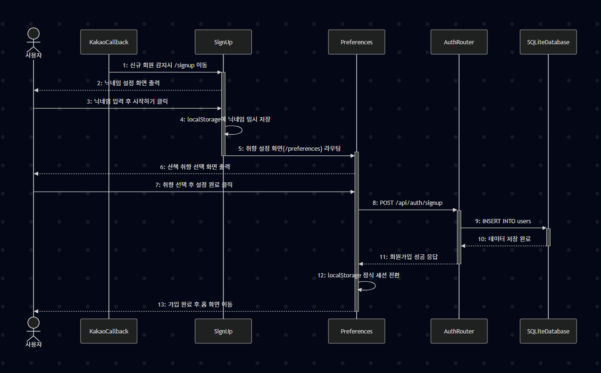
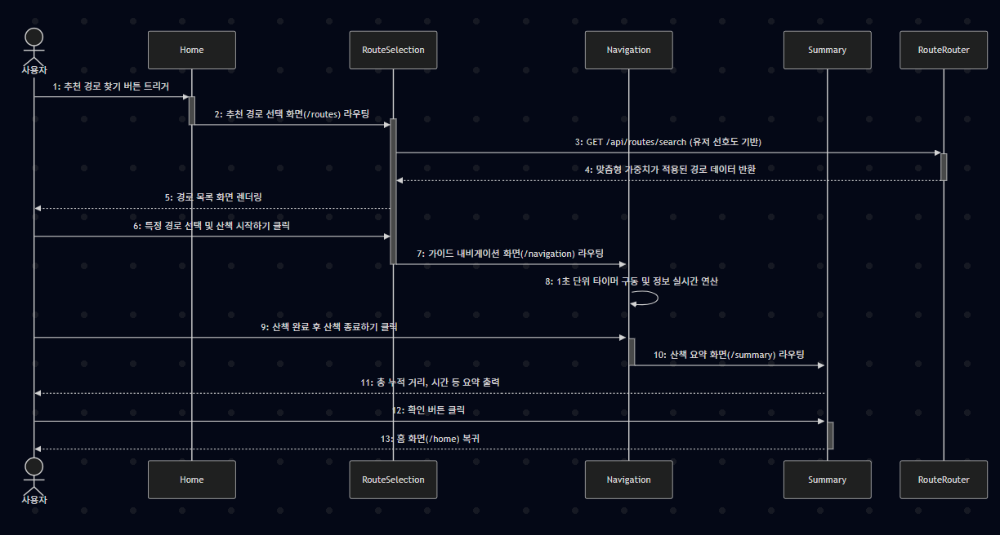
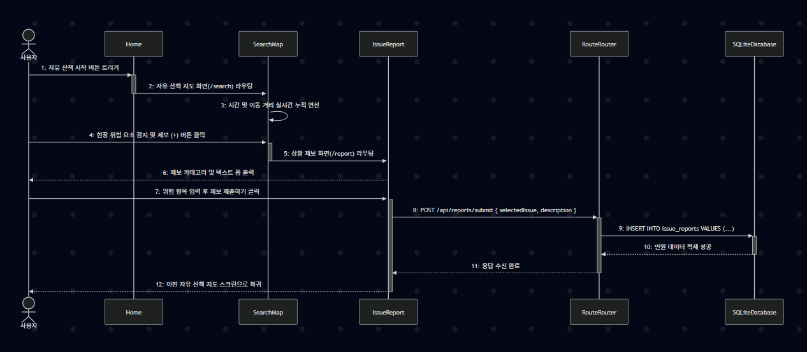
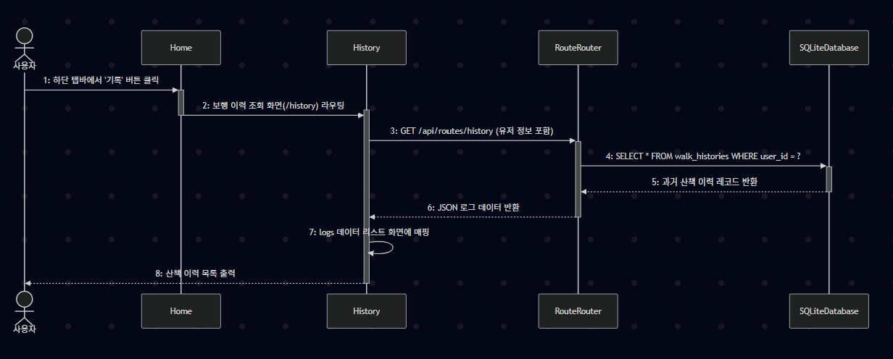
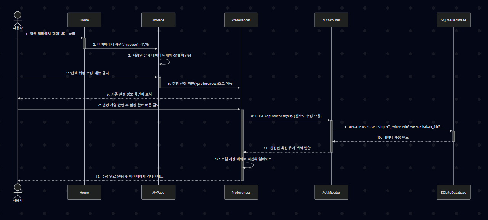
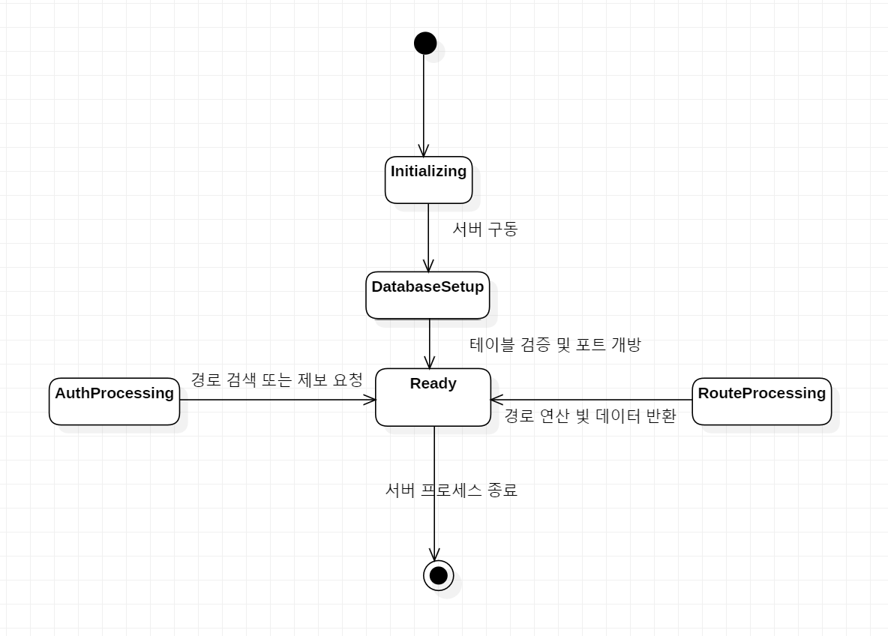
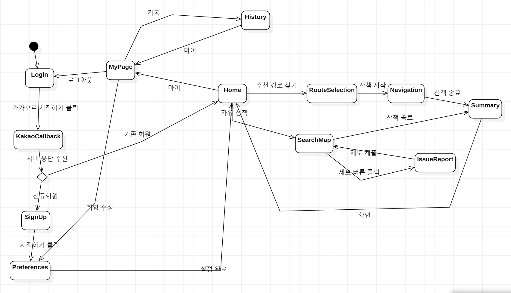

# **MyRoute** 
Conceptualization
 
 

 
 

**Student No: 22411863**

**Name: 진다혜**

**E-mail: jindahye0315_@naver.com**

 

## [ Revision history ]

Revision date|Version #|Description|Author
---|---|---|---
2025/06/04 | 0.1 | 문서 작성 완료 | 진다혜

 
 

## = Contents =
1. Introduce .................................................................................. 

2. Class diagram ..................................................................... 

3. Sequence diagram .............................................................................................

4. State machine diagram .......................................................................... 

5. Implementation requirements ............................................................................... 

6. Glossary ..................................................................................................... 

7. References ................................................................................................. 

 
 

# 1. Introduce
MyRoute는 교통약자 및 개인별 보행 선호도를 반영하는 사용자 맞춤형 보행 경로 가이드 내비게이션 서비스이다. 기존 상용 내비게이션이 제공하는 최단 거리 중심의 안내에서 벗어나, 경사로 회피 여부, 영유아차 및 휠체어 등의 바퀴 기구 이용 가능 여부, 사용자의 보행 페이스(여유로운 걷기 또는 러닝) 등 구체적인 보행 취향 데이터를 기반으로 최적의 안전 경로를 연산하고 시각화하는 것을 핵심 가치로 둔다.

 
 

# 2. Class diagram
## 2.1 Class Diagram

 

## 2.2 Description
### 2.2.1 Login
#### (1) Attributes
* `- KAKAO_REST_API_KEY: String` : 카카오 로그인용 인증 키
* `- KAKAO_REDIRECT_URI: String` : 로그인 인증 후 돌아올 주소
* `- kakaoURL: String` : 카카오 로그인 페이지 주소
#### (2) Methods
* `+ handleKakaoLogin(): void` : 카카오 로그인 페이지로 이동

### 2.2.2 KakaoCallback
#### (1) Attributes
* `- code: String` : 카카오 로그인 결과로 받는 인증 코드
* `- searchParams: URLSearchParams` : 주소창의 파라미터를 읽기 위한 객체
#### (2) Methods
* `+ useEffect(): void` : 로그인 코드를 확인하고 백엔드 서버로 전송

### 2.2.3 SignUp
#### (1) Attributes
* `- nickname: String` : 사용자가 입력한 닉네임
#### (2) Methods
* `+ handleNext(): void` : 닉네임 검사 후 취향 설정 페이지로 이동

### 2.2.4 Preferences
#### (1) Attributes
* 등록된 속성 없음
#### (2) Methods
* `+ handleComplete(): void` : 선택한 산책 취향 설정을 서버에 저장하고 가입 완료

### 2.2.5 Home
#### (1) Attributes
* 등록된 속성 없음
#### (2) Methods
* `+ useEffect(): void` : 홈 화면 로드 시 유저 세션 확인

### 2.2.6 RouteSelection
#### (1) Attributes
* `- selected: Integer` : 사용자가 선택한 경로 번호
* `- routes: Array<Object>` : 서버에서 받아온 추천 경로 리스트
#### (2) Methods
* `+ useEffect(): void` : 추천 경로 화면이 켜질 때 경로 리스트를 가져옴

### 2.2.7 Navigation
#### (1) Attributes
* `- time: Integer` : 실시간 산책 시간
* `- distance: Float` : 실시간 이동 거리
* `- speed: Float` : 현재 보행 속도
#### (2) Methods
* `+ useEffect(): void` : 타이머 가동 및 실시간 산책 정보 갱신

### 2.2.8 Summary
#### (1) Attributes
* 등록된 속성 없음
#### (2) Methods
* `+ useEffect(): void` : 산책 종료 후 총 거리, 시간 등 요약 데이터 표시

### 2.2.9 SearchMap
#### (1) Attributes
* `- time: Integer` : 자유 산책 시간
* `- distance: Float` : 자유 산책 거리
#### (2) Methods
* `+ useEffect(): void` : 자유 산책 화면 정보 실시간 갱신

### 2.2.10 IssueReport
#### (1) Attributes
* `- selectedIssue: String` : 선택한 도로 위험 요소 종류 (공사, 파손 등)
* `- issues: Array<Object>` : 선택 가능한 제보 목록 데이터
#### (2) Methods
* `+ handleSubmit(): void` : 입력한 위험 제보 내용을 서버에 제출

### 2.2.11 MyPage
#### (1) Attributes
* `- nickname: String` : 마이페이지에 표시할 유저 닉네임
* `- menuItems: Array<Object>` : 마이페이지 메뉴 리스트
#### (2) Methods
* `+ useEffect(): void` : 저장된 유저 정보를 가져와 화면에 표시

### 2.2.12 History
#### (1) Attributes
* `- logs: Array<Object>` : 서버에서 가져온 과거 산책 기록 리스트
#### (2) Methods
* `+ useEffect(): void` : 화면 로드 시 과거 산책 기록들을 가져옴

### 2.2.13 AuthRouter
#### (1) Attributes
* 등록된 속성 없음
#### (2) Methods
* `+ POST_api_auth_kakao(req: Request, res: Response): Promise<void>` : 카카오 로그인 처리 및 기존 가입 여부 확인
* `+ POST_api_auth_signup(req: Request, res: Response): Promise<void>` : 신규 회원의 정보와 취향을 DB에 저장 (회원가입 완료)

### 2.2.14 RouteRouter
#### (1) Attributes
* 등록된 속성 없음
#### (2) Methods
* `+ GET_api_routes_search(req: Request, res: Response): Promise<void>` : 취향 맞춤형 보행 경로 탐색 결과 반환
* `+ POST_api_reports_submit(req: Request, res: Response): Promise<void>` : 사용자가 제보한 도로 위험 요소 데이터 저장
* `+ GET_api_routes_history(req: Request, res: Response): Promise<void>` : 사용자의 과거 산책 이력 리스트 반환

### 2.2.15 Server
#### (1) Attributes
* `- app: ExpressApplication` : Express 서버 인스턴스
* `- db: SQLite3Database` : SQLite 데이터베이스 연결 객체
* `- PORT: Integer` : 서버 포트 번호
#### (2) Methods
* `+ listen(port: Integer, callback: Function): void` : 지정된 포트에서 백엔드 서버 구동
* `- initDatabase(): Promise<void>` : 데이터베이스 파일 연결 및 users 테이블 자동 생성

### 2.2.16 SQLiteDatabase
#### (1) Attributes
* `+ users: TableSchema` : 회원 정보 및 산책 취향 저장 테이블
* `+ walk_histories: TableSchema` : 산책 이력 기록 저장 테이블
* `+ issue_reports: TableSchema` : 도로 위험 요소 제보 저장 테이블
#### (2) Methods
* `+ open(options: Object): Promise<Database>` : 데이터베이스 파일 열기
* `+ exec(sql: String): Promise<void>` : 반환값 없는 SQL 명령어 실행 (테이블 빌드 등)
* `+ get(sql: String, params: Array): Promise<Object>` : SQL 질의에 맞는 단일 데이터 행 조회
* `+ run(sql: String, params: Array): Promise<ResultObject>` : 데이터 추가(INSERT) 및 수정(UPDATE) 명령어 실행

 
 

# 3. Sequence diagram
## 3.1 로그인 (Login)

 
위의 그림은 사용자가 카카오 계정으로 시스템에 인증을 요청하고, 로그인 성공 시 홈 화면으로 이동하는 과정을 표현한 Sequence Diagram이다. 사용자가 로그인을 요청하면 주소창에서 인가 코드를 확보한 KakaoCallback 컴포넌트가 백엔드 서버로 검증을 요청한다. 서버는 카카오 프로필을 조회한 뒤 데이터베이스에서 기존 유저임을 확인하여 회원 정보를 반환하고, 클라이언트는 이를 세션에 저장한 뒤 홈 화면으로 진입한다.

 

## 3.2 회원가입 (Sign Up)

 
위의 그림은 최초 로그인 시 등록되지 않은 신규 회원으로 판명되었을 때 가입을 진행하는 과정을 표현한 Sequence Diagram이다. 가입하지 않은 유저는 SignUp 컴포넌트에서 사용할 닉네임을 입력하고, Preferences 컴포넌트에서 경사로 회피나 바퀴 기구 사용 등 개인 맞춤형 산책 취향을 선택한다. 설정이 완료되면 이 데이터들이 백엔드 서버를 거쳐 데이터베이스의 users 테이블에 새롭게 저장된다.

 

## 3.3 안전 경로 추천 및 가이드 (Recommend Route & Navigate)

 
위의 그림은 사용자가 개인의 보행 특성에 맞는 추천 경로를 제공받고 안내를 수행하는 과정을 표현한 Sequence Diagram이다. 화면이 전환되면 RouteSelection 컴포넌트가 사용자의 선호도 필터에 맞춰 연산된 경로 후보 리스트를 서버로부터 받아와 화면에 표시한다. 사용자가 산책을 시작하면 Navigation 컴포넌트가 시간과 거리를 실시간으로 기록하며, 종료 시 Summary 컴포넌트가 산책 결과를 요약하여 보여준다.

 

## 3.4 자유 산책 및 위험 제보 (Free Walking & Issue Report)

 
위의 그림은 목적지 없이 자유롭게 산책을 진행하다가 도로의 공사나 파손 등의 위험 요소를 발견해 제보하는 과정을 표현한 Sequence Diagram이다. SearchMap 컴포넌트에서 실시간 산책 정보를 기록하던 중, 유저가 제보 버튼을 누르면 IssueReport 화면으로 이동한다. 유저가 선택한 위험 종류와 상세 설명은 백엔드 서버를 거쳐 데이터베이스의 issue_reports 테이블에 등록된다.

 

## 3.5 과거 이력 조회 (View Activity History)

 
위의 그림은 사용자가 과거에 완료했던 산책 활동 기록들을 모아서 열람하는 과정을 표현한 Sequence Diagram이다. 유저가 기록 탭을 누르면 History 컴포넌트가 백엔드 서버로 과거 이력 데이터를 요청한다. 서버는 데이터베이스의 walk_histories 테이블에서 해당 사용자의 기록들을 최신순으로 조회하여 반환하고, 프론트엔드는 이를 카드 리스트 형태로 화면에 출력한다.

 

## 3.6 프로필 및 취향 수정 (Manage Profile & Preferences)

 
위의 그림은 마이페이지 시스템을 통해 기존에 등록되어 있던 사용자의 산책 취향 및 보행 옵션을 변경하는 과정을 표현한 Sequence Diagram이다. MyPage 컴포넌트에서 수정 메뉴를 선택하면 Preferences 화면으로 이동하여 기존 설정값을 변경할 수 있다. 완료 버튼을 누르면 서버가 데이터베이스의 users 테이블에 수정 명령(UPDATE)을 수행하여 데이터를 갱신하고 최신 유저 정보를 동기화한다.

 
 

# 4. State machine diagram
## 4.1 Server System State Machine Diagram

 
위의 그림은 MyRoute 백엔드 서버의 구동 단계부터 사용자 요청(인증, 경로 검색 등)을 수신하고 처리하는 전체적인 행동 주기를 표현한 State Machine Diagram이다. 서버가 기동되면 환경 변수와 데이터베이스를 초기화한 뒤, 클라이언트의 API 요청을 기다리는 대기(Ready) 상태를 유지하며 각 요청에 따라 인증 및 데이터 연산을 반복 수행한다.

 

## 4.2 Client System State Machine Diagram

 
위의 그림은 사용자가 조작하는 MyRoute 모바일 어플리케이션 클라이언트 시스템의 화면 전환과 동작 모드를 표현한 State Machine Diagram이다. 앱이 구동되면 Login 대기 상태에서 KakaoCallback을 통한 인증 과정을 거치며, Choice 노드를 통해 가입 유무를 판단하여 온보딩(SignUp 및 Preferences)을 진행하거나 메인 Home 화면으로 진입한다. 이후 사용자의 인터랙션에 따라 RouteSelection과 Navigation을 거치는 추천 가이드 모드, SearchMap과 IssueReport 중심의 자유 산책 모드, 그리고 MyPage와 History를 관리하는 사용자 설정 모드로 전환을 수행한다.

 
 

# 5. Implementation requirements
## 5.1 Operating Environments
본 시스템을 구현하고 실행하기 위한 하드웨어(HW) 및 소프트웨어(SW) 환경 사양은 다음과 같다.

### 1) Hardware Environment (하드웨어 환경)
* **개발 환경** : Windows 10/11 또는 macOS 구동 PC
* **실행 환경** : 웹 브라우저 구동이 가능한 스마트폰 및 모바일 기기

### 2) Software Environment (소프트웨어 환경)
* **개발 도구 (IDE)** : Visual Studio Code (VS Code)
* **개발 언어** : JavaScript (HTML5 / CSS3 포함)
* **실행 런타임** : Node.js
* **프론트엔드 프레임워크** : React.js
* **백엔드 프레임워크** : Express
* **데이터베이스 (DB)** : SQLite3
* **외부 연동 API** : 
  * 카카오 로그인 (Kakao OAuth 2.0) API
  * 카카오 맵 (Kakao Map Web) API : 실시간 지도 렌더링 및 마커 표시용
  * 공공데이터포털 Open API : 보행 약자 안전 통행로 및 경사도 데이터 수집용

 
 

# 6. Glossary
본 상세 설계 문서에서 사용된 주요 소프트웨어 공학 기법, 프레임워크 및 기술적 용어들에 대한 정의는 다음과 같다.

* **UML (Unified Modeling Language)** : 소프트웨어 시스템의 구조와 동작을 시각적으로 모델링하고 문서화하기 위해 사용하는 표준 다이어그램 언어
* **Class Diagram (클래스 다이어그램)** : 시스템을 구성하는 클래스(컴포넌트)들의 내부 속성, 메서드 및 상호 간의 정적 연결 관계를 표현하는 다이어그램
* **Sequence Diagram (시퀀스 다이어그램)** : 시스템 객체들이 특정 기능(유즈케이스)을 수행하기 위해 주고받는 메시지와 데이터 흐름을 시간 순서에 따라 표현하는 다이어그램
* **State Machine Diagram (상태 머신 다이어그램)** : 시스템이나 화면 컴포넌트가 마주하는 동작 상태(State)와 사용자의 조작에 의해 발생하는 상태 변화(Transition)를 추적하여 표현하는 다이어그램
* **Actor (액터)** : 시스템 외부에서 특정 목적을 가지고 마이루트 시스템과 상호작용하는 사용자 또는 외부 인증 서비스
* **React.js** : 컴포넌트 기반으로 동적인 웹 화면(UI)을 효율적으로 빌드하기 위해 사용한 프론트엔드 자바스크립트 라이브러리
* **Express** : 클라이언트의 HTTP API 요청(인증, 경로 검색, 제보 등)을 수렴하고 분기 처리하기 위해 활용한 Node.js 기반의 백엔드 웹 프레임워크
* **SQLite3** : 별도의 외부 데이터베이스 서버 설치 없이 백엔드 내부의 단일 바이너리 파일(`myroute.db`) 형태로 영속성 데이터를 적재 및 관리하는 경량 관계형 데이터베이스 엔진
* **OAuth 2.0** : 사용자의 비밀번호 노출 없이 카카오 등의 외부 소셜 계정 인증 체계를 안전하게 대리 활용하기 위한 권한 부여 표준 프로토콜
* **API (Application Programming Interface)** : 프론트엔드(React)와 백엔드(Express) 간에 데이터 및 트랜잭션 요청을 주고받기 위해 정의한 통신 인터페이스 규격
* **LocalStorage (로컬 스토리지)** : 사용자가 로그인을 완료한 후 닉네임이나 세션 토큰 정보를 브라우저에 반영구적으로 유지하기 위해 사용하는 웹 저장 공간

 

# 7. References
본 상세 설계서를 작성하기 위해 참조한 표준 명세, 공식 기술 문서 및 도구 가이드는 다음과 같다.

* StarUML 공식 사용자 가이드라인 및 다이어그램 표기법 사양서, https://docs.staruml.io

